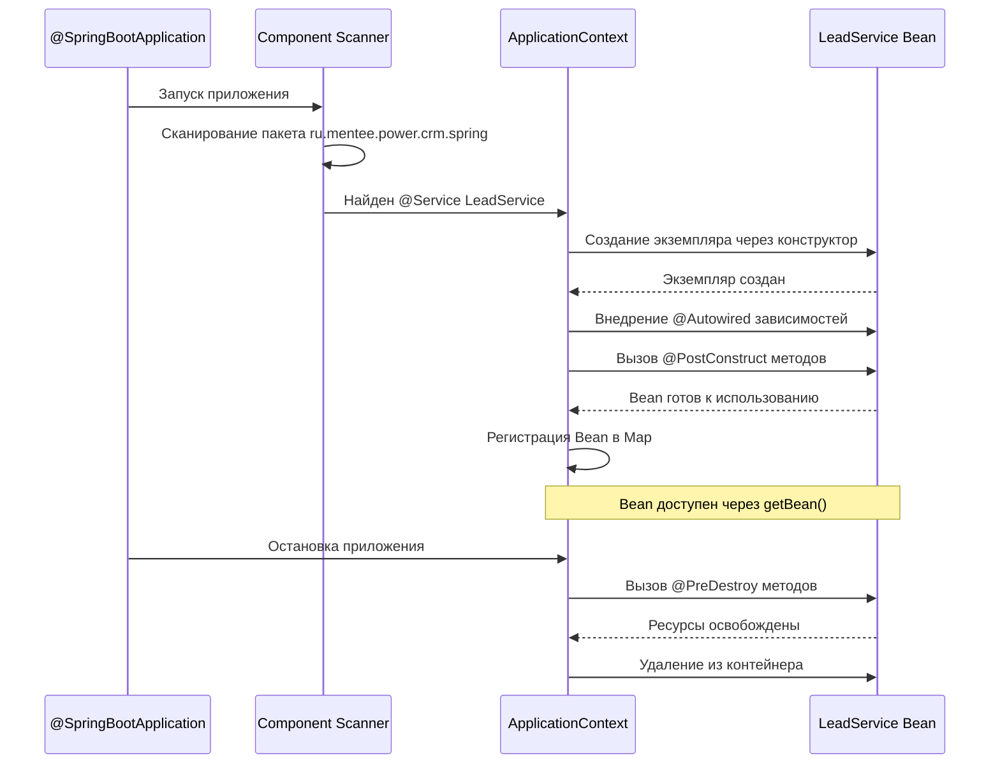

# BCORE

[](https://github.com/WinKeeper/BCORE/actions/workflows/ci.yml)

## Технологический стек проекта

### Языки и платформы

- **Java 25 LTS** — основной язык разработки
- **Gradle 9.x** — система сборки (через Gradle Wrapper)

### Инструменты качества кода

- **Checkstyle** — статический анализ стиля кода
    - Конфигурация: `config/checkstyle/checkstyle.xml`
    - Запуск: `./gradlew checkstyleMain`
- **JUnit 5** — фреймворк тестирования
    - Запуск: `./gradlew test`

### CI/CD

- **GitHub Actions** — автоматическая проверка PR
    - Checkstyle на каждый коммит
    - Тесты на каждый коммит
    - Конфигурация: `.github/workflows/`

### Правила кода

- Стиль: Google Java Style Guide (через Checkstyle)
- Коммиты: Conventional Commits (`feat:`, `fix:`, `docs:`)
- Ветки: `feature/DVT-X` для задач, `master` — основная
- Pull Request: обязателен для слияния в master

## BCORE-1: Первый класс Lead — От переменных к объектам

### Checklist

- [X] Gradle проект создан через IntelliJ IDEA (File → New → Project)
- [X] build.gradle обновлен (JUnit 5.11, AssertJ 3.26.3)
- [X] Lead.java создан в ru.mentee.power.crm.domain
- [X] Все 5 полей объявлены как private
- [X] Конструктор принимает 5 параметров
- [X] Getters для всех полей реализованы
- [X] toString() переопределен с @Override
- [X] LeadTest создан с минимумом 5 тестами
- [X] Тесты проходят (Ctrl+Ctrl → gradle test)
- [X] Coverage ≥80% (JaCoCo отчет проверен)

### Результат само-ревью BCORE-1

Ошибок не обнаружено согласно Code Review Checklist раздела.

## BCORE-2: Массив Lead[] и дедупликация — От одного объекта к коллекции

### Инсайты BCORE-2

- массив с простыми типами данных инициализируется с '0';
- массив объектов инициализируется с 'null';
- надо привыкать использовать for each;
- при вызове метода ```methodName()``` эквивалентно ```this.methodName()``` со ссылкой на текущий объект класса;
- AI хорошо помогает в плане объяснения в контексте самого проекта.

### Результат само-ревью BCORE-2

Ошибок не обнаружено согласно Code Review Checklist раздела.

## BCORE-3: Контракт equals/hashCode — Правильное сравнение объектов

### Контракт equals(): 5 обязательных свойств

Метод `equals()` должен соблюдать **контракт** — набор правил, которые гарантируют корректную работу в Java коллекциях.
Эти правила описаны в JavaDoc класса Object и являются частью спецификации Java.

**Свойство 1: Рефлексивность (Reflexive)** Любой объект равен сам себе: `x.equals(x)` всегда должен возвращать `true`.

```java
Lead lead = new Lead("1", "ivan@mail.ru", "+7123", "TechCorp", "NEW");
lead.

equals(lead);  // Должно быть true
```

Нарушение рефлексивности ломает коллекции: HashSet может не найти объект, который только что добавили.

**Свойство 2: Симметричность (Symmetric)** Если `x.equals(y)` возвращает `true`, то `y.equals(x)` тоже должен возвращать
`true`. Порядок сравнения не важен.

```java
Lead lead1 = new Lead("1", "ivan@mail.ru", "+7123", "TechCorp", "NEW");
Lead lead2 = new Lead("1", "ivan@mail.ru", "+7123", "TechCorp", "NEW");

if(lead1.

equals(lead2)){
    assert lead2.

equals(lead1);  // Должно быть true
}
```

**Свойство 3: Транзитивность (Transitive)** Если `x.equals(y)` и `y.equals(z)`, то `x.equals(z)` тоже должен быть
`true`. Цепочка равенства сохраняется.

```java
Lead lead1 = new Lead("1", "ivan@mail.ru", "+7123", "TechCorp", "NEW");
Lead lead2 = new Lead("1", "ivan@mail.ru", "+7123", "TechCorp", "NEW");
Lead lead3 = new Lead("1", "ivan@mail.ru", "+7123", "TechCorp", "NEW");

if(lead1.

equals(lead2) &&lead2.

equals(lead3)){
    assert lead1.

equals(lead3);  // Должно быть true
}
```

Нарушение транзитивности ведет к нелогичным результатам: объект равен A и B, но A не равен B.

**Свойство 4: Консистентность (Consistent)** Несколько вызовов `x.equals(y)` должны возвращать одинаковый результат,
если данные объектов не изменились.

```java
Lead lead1 = new Lead("1", "ivan@mail.ru", "+7123", "TechCorp", "NEW");
Lead lead2 = new Lead("1", "ivan@mail.ru", "+7123", "TechCorp", "NEW");

boolean result1 = lead1.equals(lead2);
boolean result2 = lead1.equals(lead2);
assert result1 ==result2;  // Должен быть одинаковым
```

Нарушение консистентности: equals() зависит от текущего времени или случайного значения — это ошибка.

**Свойство 5: null-безопасность (Non-nullity)** Любой объект не равен `null`: `x.equals(null)` всегда должен возвращать
`false`, никогда не выбрасывать NullPointerException.

```java
Lead lead = new Lead("1", "ivan@mail.ru", "+7123", "TechCorp", "NEW");
lead.

equals(null);  // Должно быть false, не NPE!
```

Если equals() не проверяет null, вызов `lead.equals(null)` выбросит NPE при попытке привести null к типу Lead — это
нарушение контракта.

**Главное правило:** Если переопределяешь `equals()`, **обязательно** переопределяй `hashCode()` тоже. Иначе объекты не
будут корректно работать в HashMap, HashSet, Hashtable.

**Контракт hashCode():**

1. Если `x.equals(y)` возвращает `true`, то `x.hashCode() == y.hashCode()` **обязательно** должно быть `true`
2. Если `x.equals(y)` возвращает `false`, `x.hashCode()` и `y.hashCode()` **могут** быть одинаковыми или разными (это
   называется "коллизия хешей")

Пример нарушения: переопределили equals() по id, но не переопределили hashCode():

```java
class Lead {
  private String id;
  // ... остальные поля ...

  @Override
  public boolean equals(Object o) {
    if (this == o) return true;
    if (o == null || getClass() != o.getClass()) return false;
    Lead lead = (Lead) o;
    return Objects.equals(id, lead.id);
  }

  // НЕТ переопределенного hashCode()!
}

Lead lead1 = new Lead("1", "ivan@mail.ru", "+7123", "TechCorp", "NEW");
Lead lead2 = new Lead("1", "ivan@mail.ru", "+7123", "TechCorp", "NEW");

lead1.

equals(lead2);  // true (equals переопределен)
lead1.

hashCode() ==lead2.

hashCode();  // false! (hashCode стандартный, основан на адресе)

// Использование в HashMap
Map<Lead, String> map = new HashMap<>();
map.

put(lead1, "Status A");
map.

get(lead2);  // null! HashMap не нашел объект, потому что hashCode разные
```

HashMap использует hashCode() для быстрого поиска "корзины" (bucket), а затем equals() для точного сравнения объектов в
корзине. Если hashCode() разные, HashMap даже не вызовет equals() — сразу решит что объекты разные.

**Правильная реализация:**

```java

@Override
public int hashCode() {
  return Objects.hash(id);  // Хеш вычисляется по тем же полям, что и equals
}
```

Теперь два Lead с одинаковым id будут иметь одинаковый hashCode:

```java
lead1.hashCode() ==lead2.

hashCode();  // true
map.

get(lead2);  // ⟪§⟫ - HashMap нашел объект!
```

### Инсайты BCORE-3

- всё время забываю, что при вызове метода в классе он ссылается сам на себя

### Результат само-ревью BCORE-3

Ошибок не обнаружено согласно Code Review Checklist раздела.

## BCORE-4: Три способа создания класса + UUID вместо String

### Когда использовать каждый подход

Обычный класс (с конструктором и геттерами вручную) используется для mutable entity — изменяемых сущностей с поведением
и бизнес-логикой. Например, Lead с методами qualify(), reject(), convert() — это не просто данные, а объект с состоянием
и поведением. Обычный класс позволяет полный контроль: можно добавить валидацию в конструктор, сделать поля изменяемыми
через сеттеры, добавить бизнес-методы. Record используется для immutable value objects — неизменяемых объектов-значений
без поведения. Например, Contact (firstName, lastName, email) или Address (city, street, zip) — это просто данные для
передачи между слоями приложения. Record даёт максимальную краткость, гарантирует неизменяемость, автоматически
реализует правильный equals/hashCode. Lombok используется в legacy проектах на старых версиях Java (до 14) или когда
нужны mutable классы с автогенерацией. В новых проектах на Java 17+ предпочтение отдаётся Record как стандарту языка.
Trade-offs: явное против неявного

### Trade-offs: явное против неявного

Каждый подход имеет компромиссы. Обычный класс максимально явный — всё написано руками, легко читать и понимать, но
много кода (30+ строк), легко допустить ошибку, долго писать и поддерживать. Record максимально краткий — одна строка,
компилятор гарантирует правильность, но неизменяемость обязательна (нельзя изменить поле после создания), геттеры без
префикса get (firstName() вместо getFirstName()), ограниченная кастомизация. Lombok балансирует между ними — можно
выбрать что генерировать (@Getter, @EqualsAndHashCode отдельно или @Data всё сразу), поддерживает mutable классы, но
требует внешнюю зависимость (не часть Java), генерация кода "скрыта" (нужно знать что делает аннотация), потенциальные
проблемы с IDE (хотя современные IDE поддерживают Lombok хорошо). Для Backend Core модуля мы выбираем Record как
современный стандарт Java: краткость + безопасность + нет внешних зависимостей.

### Инсайты BCORE-4

- Record очень удобный тип класса

### Результат само-ревью BCORE-4

Ошибок не обнаружено согласно Code Review Checklist раздела.

## BCORE-5: ООП: инкапсуляция и композиция

Q: Когда использовать композицию, а когда наследование?

A: Композицию используйте в 95% случаев — когда переиспользуете код, группируете связанные данные, следуете принципу
единственной ответственности. Lead "имеет" контактные данные → композиция (private Contact contact). Наследование
используйте только для полиморфизма — когда нужен общий интерфейс для разных реализаций. Пример: метод processPayment(
Payment payment) работает с разными типами платежей (CreditCard, PayPal, BankTransfer) через общий интерфейс Payment →
наследование. Проверка: задайте вопрос "является ли A разновидностью B?" Если да — наследование, если нет — композиция.
Lead является Contact? Нет → композиция. Dog является Animal? Да → наследование.

Q: Почему композиция лучше наследования для переиспользования кода?

A: Наследование создаёт жёсткую связь — дочерний класс зависит от всех изменений родительского класса ("хрупкий базовый
класс"). Если Contact добавит метод, Lead унаследует его автоматически, даже если это не нужно. Наследование допускает
только одного родителя в Java (single inheritance), композиция — множество компонентов (Lead содержит Contact, Address,
ActivityLog одновременно). Композиция гибче: можно заменить Contact на EnhancedContact без изменения Lead, при
наследовании пришлось бы менять структуру классов. Классический пример: утка и летает и плавает, куда её поместить в
иерархию Bird → FlyingBird / SwimmingBird? Композиция решает просто: Duck has FlyingAbility, Duck has SwimmingAbility.

Q: Как обращаться к полям через композицию? Не слишком ли длинные цепочки?

A: Доступ через делегацию: ```lead.contact().address().city()``` — три уровня вызовов. Это выглядит длиннее чем
```lead.getCity()```, но делает структуру явной и поддерживает инкапсуляцию. Каждый уровень возвращает объект следующего
уровня. Альтернатива — "сквозные геттеры": добавить в Lead метод ```public String city() { return contact.address()
.city(); }```, чтобы вызывать ```lead.city()``` напрямую. Trade-off: сквозные методы удобнее для клиента, но скрывают
композицию
и добавляют boilerplate (нужен сквозной метод для каждого поля). В учебном модуле используем явную делегацию для
понимания структуры, в enterprise выбор зависит от публичности API.

Q: Что делать если промежуточный объект может быть ```null```?

A: В Sprint 1 гарантируем через валидацию в конструкторе, что Contact и Address не null. Добавляем проверку в компактный
конструктор Record:
```public Lead { if (contact == null) throw new IllegalArgumentException("Contact cannot be null");``` }.
Это делает композицию безопасной — lead.contact().address().city() никогда не бросит NullPointerException. В следующих
модулях (Java Advanced, Spring) изучим Optional для явного выражения "может быть null":
```Optional<Contact> contact()``` и
безопасной навигации: ```lead.contact().map(Contact::address).map(Address::city).orElse("Unknown")```. Для Sprint 1
используем
обязательные поля через валидацию.

Q: Зачем создавать отдельные классы для Contact и Address? Не проще оставить поля в Lead?

A: Отдельные классы дают переиспользование (DRY) и группировку по смыслу (cohesion). До рефакторинга: поля email, phone,
city, street, zip дублируются в Lead, Customer, Employee, Supplier — 4 копии. При добавлении поля (например,
countryCode) нужно изменить 4 класса. После рефакторинга: Contact и Address создаются один раз, используются везде —
изменение в одном месте. Группировка: Address инкапсулирует всё о географии (city, street, zip), Contact — всё о
контактных данных (email, phone, address). Это принцип единственной ответственности (Single Responsibility Principle).
Lead отвечает за бизнес-логику лида (company, status), Contact — за контактную информацию, Address — за географические
данные. Каждый класс имеет одну причину для изменения.

Q: Можно ли использовать композицию с обычными классами или только с Record?

A: Композиция работает с любыми типами классов: обычные классы, Record, даже интерфейсы. Для ```value objects (Contact,
Address)``` предпочтительнее Record — краткость, неизменяемость, автогенерация equals/hashCode. Для mutable entity с
бизнес-логикой используются обычные классы. Например, в Sprint 3 создадим ```class LeadService { private LeadRepository
repository; } ``` — композиция обычного класса с интерфейсом. Композиция — это паттерн организации кода, не зависящий от
конкретного типа класса. Главное: один класс содержит другой как поле (private Contact contact), доступ через
делегацию (getContact()). Record удобен для неизменяемых компонентов композиции, обычные классы — для изменяемых или с
поведением.

### Инсайты BCORE-5

- Композиция используется в 95% случаев.

### Результат само-ревью BCORE-5

Ошибок не обнаружено согласно Code Review Checklist раздела.

## BCORE-6: Repository интерфейс и InMemory реализация

### Пять ключевых навыков Repository Pattern

1. Понимание интерфейса как контракта

Интерфейс Repository определяет обещание предоставить операции с данными без указания как именно эти операции
реализованы. Это фундаментальная концепция абстракции: высокоуровневый код зависит от контракта (интерфейса),
низкоуровневый код предоставляет реализацию. Dependency Inversion Principle гласит - зависимость направлена от деталей к
абстракциям, а не наоборот.

Практический пример: сервис LeadService имеет поле private final Repository<Lead> repository (тип - интерфейс). При
создании сервиса передаем конкретную реализацию: new LeadService(new InMemoryLeadRepository()) для разработки или new
LeadService(new JdbcLeadRepository()) для продакшена. Сервис вызывает repository.findAll() не зная деталей - данные в
памяти, PostgreSQL или Redis. Код сервиса остается стабильным при смене технологий хранения. Это снижает coupling и
повышает testability.

Источники: Oracle - Interfaces, Martin Fowler - Repository Pattern

2. Generic типы для переиспользования кода

Generic типы Repository<T> позволяют создать один интерфейс для разных сущностей: Repository, Repository, Repository.
Параметр T (type parameter) заменяется конкретным классом при использовании. Это type-safe альтернатива Object -
компилятор проверяет типы на этапе компиляции, исключая runtime ошибки ClassCastException.

Современная практика: начинать с конкретного Repository без дженериков для понимания концепции, затем переходить к
Repository для переиспользования. Generic Repository имеет ограничения в сложных сценариях (считается анти-паттерном
когда интерфейс постоянно расширяется новыми методами), но идеален для InMemory реализаций и простых CRUD операций.
Spring Data JPA решает проблемы Generic Repository через CrudRepository с умными методами query by method name.

Источники: Oracle - Generics, Dot Net Tutorials - Generic Repository

3. ArrayList performance characteristics

ArrayList предоставляет fast random access (get/set за O(1)), fast iteration, amortized O(1) добавление в конец. Внутри
использует Object[] массив с automatic resize: capacity увеличивается в 1.5 раза когда заканчивается место. Операции
поиска (contains, indexOf) - O(n) линейные, так как требуют проверки каждого элемента.

Critical tradeoffs для Repository: ArrayList excellent для небольших коллекций (10-100 элементов), simple iteration,
случаев где order важен. Проблемы начинаются при 1000+ элементов: findById становится медленным (O(n) вместо O(1) у
HashMap), дедупликация через contains требует full scan. В BCORE-7 решим через HashSet (O(1) для contains), в BCORE-8
через HashMap (O(1) для get by ID). Правило: до ~5 элементов ArrayList быстрее чем HashMap из-за lower overhead, после
5-6 элементов HashMap выигрывает.

Источники: Baeldung - Collections Time Complexity, Stack Overflow - ArrayList vs HashMap

4. Aggregate Root и границы Repository

Aggregate Root определяет границу транзакции и консистентности в домене. Только корень агрегата получает Repository -
внутренние объекты доступны через навигацию от корня. Lead - Aggregate Root (имеет UUID, управляет жизненным циклом),
Contact и Address - value objects (без самостоятельного ID, immutable, равенство по значениям).

Ошибка новичков: создавать Repository для каждого entity класса - ContactRepository, AddressRepository. Это нарушает
Aggregate boundaries: Contact должен существовать только в контексте Lead, не как standalone entity. Изменения Contact
всегда через Lead: lead.updateContact(newContact), не через отдельный ContactRepository.save(). Это обеспечивает
invariants агрегата - бизнес-правила проверяются на уровне Lead, который контролирует свои внутренние объекты.

Источники: Martin Fowler - DDD Aggregate, Baeldung - Aggregate Root

5. InMemory реализации для тестирования

InMemory Repository - паттерн где данные хранятся в коллекции вместо базы данных. Быстрое создание/уничтожение делает
InMemory идеальным для unit тестов: не нужны Testcontainers, H2, или моки. Тесты проверяют реальное поведение
Repository (дедупликация, порядок, границы) за миллисекунды.

Преимущество перед моками: InMemory Repository содержит реальную логику (дедупликация через contains, навигация через
stream), а моки просто возвращают stub данные. Когда тестируешь LeadService с InMemory repository, проверяешь интеграцию
сервиса с реальным Repository API, не с mockito заглушками. Многие production проекты используют InMemory для тестов:
создают общий интерфейс, тесты работают с интерфейсом, runtime использует JdbcRepository.

---

### Про класс vs record для InMemory Repository

`InMemoryLeadRepository` — **обычный класс**, не record. Это правильный выбор.

|             | Record                     | Обычный класс                      |
|-------------|----------------------------|------------------------------------|
| Состояние   | immutable (финальные поля) | **мутабельное** (список `storage`) |
| Конструктор | канонический (все поля)    | **пустой по умолчанию**            |
| Назначение  | данные (DTO, Value Object) | **сервис/хранилище**               |

**equals/hashCode — не нужны.** `InMemoryLeadRepository` — сервис, его экземпляры не сравнивают и не кладут в HashMap.
`equals` от Object (по ссылке) достаточно.

### Aggregate Root (Lead) + Value Objects (Contact, Address)

Lead — **корень агрегата** (Aggregate Root): имеет UUID, управляет жизненным циклом. Contact и Address — **Value Objects
**: не имеют самостоятельного ID, immutable, доступны только через Lead.

#### Бытовые аналогии

**1. Человек и его паспорт**

Lead — человек (уникальный ID, существует сам по себе). Contact — страница с адресом прописки (не существует без
паспорта). Address — конкретный адрес на странице.

```
Человек (Lead)
  └── Страница с адресом (Contact)
        └── Город, улица, индекс (Address)
```

**2. Телефонная книга**

Контакт — корень. Номер телефона — значение (не существует без контакта). Адрес — значение.

#### Почему это важно

Без этой архитектуры можно создать `ContactRepository` и сохранить `Contact` без `Lead`:

- Contact хранит email лида — без Lead непонятно, кому он принадлежит
- При удалении Lead его Contact останется сиротой
- Изменение Contact через `contactRepository.save()` минует валидацию Lead

#### Схема

```
Repository:          LeadRepository  (только корень!)
                        │
Aggregate Root:       Lead  (UUID, жизненный цикл)
                      / \
Value Objects:   Contact  Address  (без ID, immutable)
                   /
               Address  (вложенный)
```

Граница: всё внутри Lead — целостная единица. Изменение Contact = новый Lead. Удаление Lead = удаление Contact и
Address.

### Почему бизнес-код зависит от интерфейса Repository<T>, а не от InMemoryLeadRepository?

**Dependency Inversion Principle (DIP):** высокоуровневый код не должен зависеть от низкоуровневых реализаций. Оба
должны зависеть от абстракций (интерфейсов).

#### Пример из проекта

Без DIP — жёсткая привязка:

```java
public class LeadService {
  private final InMemoryLeadRepository repository;  // зависит от конкретной реализации
}
```

С DIP — через интерфейс:

```java
public class LeadService {
  private final Repository<Lead> repository;  // зависит от абстракции
}
```

**Что это даёт:**

1. **Замена реализации без правки бизнес-кода**
    - Тесты: `new InMemoryLeadRepository()` — быстро, без БД
    - Production: `new PostgresLeadRepository()` — реальная БД
    - Код `LeadService` при этом **не меняется**

2. **Бытовой пример: зарядка для телефона**

   | Компонент | В IT | Аналогия |
                                                                                                                                                                  |---|---|---|
   | Интерфейс | `Repository<T>` | USB-C разъём |
   | Реализация 1 | `InMemoryLeadRepository` | Зарядка от PowerBank |
   | Реализация 2 | `PostgresLeadRepository` | Зарядка от розетки |
   | Потребитель | `LeadService` | Телефон |

   Телефону (сервису) всё равно, откуда идёт энергия — из розетки или PowerBank. Важно, что разъём USB-C (интерфейс)
   один и тот же.

   Аналогично `LeadService` не знает и не должен знать, хранятся лиды в памяти или в PostgreSQL. Он знает только
   контракт: `add`, `remove`, `findById`, `findAll`.

3. **Тестирование**

   ```java
   // Тест использует InMemory — быстро, без БД, без моков
   class LeadServiceTest {
       private Repository<Lead> repository = new InMemoryLeadRepository();
       private LeadService service = new LeadService(repository);

       @Test
       void shouldDoSomething() {
           service.doSomething();
           assertThat(repository.findAll()).hasSize(1);
       }
   }
   ```

   Если бы сервис зависел от `InMemoryLeadRepository`, в тестах нельзя было бы подменить реализацию. С интерфейсом —
   можно.

4. **Что меняется при переключении на БД**

   | Компонент | Меняется | Не меняется |
                                                                                                                                                                  |---|---|---|
   | `Repository<T>` | ❌ | ✅ Интерфейс остаётся |
   | `InMemoryLeadRepository` | ✅ Удаляется | ❌ |
   | `PostgresLeadRepository` | ✅ Добавляется | ❌ |
   | **`LeadService`** | ❌ | **✅ Без изменений** |
   | **Тесты** | ❌ | **✅ Продолжают использовать InMemory** |

### Геттеры для storage: internal state vs data holder

`private final List<Lead> storage` — **internal state**. Геттер не нужен. Весь доступ к данным уже предоставлен через
публичные методы `add`, `remove`, `findById`, `findAll`.

**Чем опасен геттер:**

```java
// Без геттера — всё под контролем:
repository.add(lead);          // проверка на null + дубликат
repository.

findAll();           // defensive copy

// С геттером — можно обойти все проверки:
repository.

getStorage().

add(lead);         // null не проверен, дубликат проскочит
repository.

getStorage().

clear();            // все данные потеряны без remove()
```

**Вывод:** `InMemoryLeadRepository` — сервис, не data holder. `findAll()` с defensive copy — единственный правильный
способ доступа.

### Типобезопасность через generics

`Repository<T>` — параметризованный интерфейс. Тип данных фиксируется на этапе компиляции.

**Без generics — ошибка в runtime:**

```java
public interface Repository {
  void add(Object entity);
}

Repository repo = new InMemoryLeadRepository();
repo.

add("not a lead");       // компилируется!
((Lead)repo.

findById(id));   // ClassCastException в runtime
```

**С generics — ошибка при компиляции:**

```java
public interface Repository<T> {
  void add(T entity);
}

Repository<Lead> repo = new InMemoryLeadRepository();
repo.

add("not a lead");       // ❌ не скомпилируется
repo.

add(new Lead(...));      // ✅ только Lead
```

**Что даёт:**

| Без `T`                      | С `Repository<T>`              |
|------------------------------|--------------------------------|
| `Object` entity — любой тип  | `T entity` — только нужный тип |
| Нужен явный каст `(Lead)`    | Каст не нужен                  |
| Ошибка в runtime             | Ошибка **при компиляции**      |
| `findAll()` → `List` (чего?) | `findAll()` → `List<T>`        |

**Аналогия:** парковка без шлагбаума пропустит велосипед (`ClassCastException` при выезде). Парковка `Parking<Car>` —
только машины, шлагбаум на въезде.

## BCORE-7: Set для уникальности — Автоматическая дедупликация

### Когда использовать Set или List

- **Set:** требуется гарантия уникальности элементов (один email может быть только у одного лида), часто проверяете
  наличие элемента через contains (поиск дубликатов перед добавлением), не важен порядок элементов или порядок
  определяется сортировкой (TreeSet), выполняете теоретико-множественные операции (объединение списков без дубликатов,
  пересечение двух наборов данных).
- **List** : допускаются дубликаты (история действий пользователя может содержать повторяющиеся события), важен порядок
  вставки (лента новостей показывается в хронологическом порядке), часто обращаетесь к элементам по индексу get(index) —
  Set не поддерживает индексный доступ, нужна сортировка с дубликатами (рейтинг игроков может иметь одинаковые баллы).

### Set — интерфейс, брат-близнец List

`Set` и `List` — оба наследуют `Collection`, но имеют разный контракт:

```
Iterable
  └── Collection
        ├── List (упорядоченный, с индексами, дубликаты разрешены)
        │     ├── ArrayList
        │     └── LinkedList
        │
        └── Set (без дубликатов, без индексов)
              ├── HashSet (на хеш-таблице, O(1))
              └── TreeSet (отсортированный, O(log n))
```

|                   | `List`       | `Set`                                         |
|-------------------|--------------|-----------------------------------------------|
| Дубликаты         | разрешены    | **запрещены**                                 |
| Порядок           | гарантирован | не гарантирован (кроме LinkedHashSet/TreeSet) |
| Доступ по индексу | `get(0)`     | нет                                           |
| `contains()`      | O(n)         | **O(1)** (HashSet)                            |

**Для `InMemoryLeadRepository`** `Set<Lead>` + `equals/hashCode` по `id` — дедупликация автоматически:

```java
leads.add(lead);  // сам проигнорирует дубликат за O(1), без отдельного contains()
```

### Map — отдельная иерархия (ключ → значение)

`Map` — это **не** `Collection`, а самостоятельный интерфейс. Хранит пары ключ → значение.

```
Map (интерфейс — ключ → значение)
  ├── HashMap (на хеш-таблице, O(1))
  │     └── LinkedHashMap (с сохранением порядка вставки)
  └── TreeMap (отсортированный по ключу, O(log n))
```

| Характеристика    | `Map`                                             |
|-------------------|---------------------------------------------------|
| Хранит            | пары **ключ → значение**                          |
| Уникальность      | **ключи** уникальны, значения могут дублироваться |
| Доступ            | `map.get(key)` — O(1) для HashMap                 |
| `containsKey()`   | O(1) — проверка существования ключа               |
| `containsValue()` | O(n) — полный проход                              |

**Отличие от `Set`:** `Set` хранит только уникальные элементы. `Map` хранит пары, где уникальны ключи, но значения могут
повторяться.

Q5: **В чём разница между HashSet, LinkedHashSet, TreeSet?**

A5: HashSet — произвольный порядок элементов, O(1) для add/contains/remove, использует hashCode/equals. LinkedHashSet —
сохраняет порядок вставки через двусвязный список, O(1) для операций, чуть медленнее HashSet из-за поддержки списка.
TreeSet — сортирует элементы через Comparable или Comparator, O(log n) для операций, элементы должны реализовывать
Comparable. Выбирайте HashSet для максимальной производительности без требований к порядку, LinkedHashSet для сохранения
порядка вставки, TreeSet для автоматической сортировки.

Q6: **Как HashSet обрабатывает null элементы?**

A6: HashSet допускает один null элемент — при добавлении null hashCode не вызывается (NullPointerException), вместо
этого null помещается в специальный бакет с индексом 0. Повторное добавление null возвращает false (дубликат). TreeSet
не допускает null (NullPointerException при добавлении), LinkedHashSet работает как HashSet — один null разрешён.

## BCORE-8: Map для быстрого поиска

### 📚 Теория: от коллекций к ассоциативным массивам

Коллекции `List` и `Set` работают с единичными элементами: `List` сохраняет порядок добавления, `Set`
обеспечивает уникальность. Но обе требуют перебора для поиска конкретного элемента — методы `indexOf()` у
`ArrayList` или `contains()` у `HashSet` внутри проходят по всем элементам до первого совпадения. Временная
сложность таких операций линейная `O(n)`: чем больше элементов, тем дольше поиск.

`Map` решает задачу по-другому: вместо хранения единичных элементов он хранит пары **"ключ → значение"**.
Ключ играет роль уникального идентификатора, а значение — это ссылка на сам объект.
Основная операция `Map` — метод `get(key)`, который возвращает значение по ключу за константное время `O(1)`.
Это значит, поиск в Map с 10 элементами и в Map с миллионом элементов занимает одинаковое время.

**Контракт `Map` интерфейса:**

`Map` не является наследником `Collection`, это отдельная ветка иерархии коллекций:

```
Iterable
  └── Collection
        ├── List
        └── Set

Map (отдельная ветка)
  ├── HashMap
  ├── LinkedHashMap
  └── TreeMap
```

Основные методы контракта:

```java
map.put(key, value)      // добавить пару, вернуть старое значение или null
map.

get(key)             // получить значение по ключу, O(1)
map.

remove(key)          // удалить пару, вернуть удалённое значение
map.

containsKey(key)     // проверить наличие ключа, O(1)
map.

keySet()             // множество всех ключей (Set<K>)
map.

values()             // коллекция всех значений (Collection<V>)
map.

entrySet()           // множество всех пар (Set<Map.Entry<K,V>>)
```

Главная особенность: каждый ключ уникален. Если вызвать `put()` дважды с одним ключом,
второй вызов перезапишет значение.

---

### 🔧 HashMap: устройство внутри

`HashMap` — самая популярная реализация `Map`. Обеспечивает `O(1)` для операций `get`/`put`/`remove`
через механизм хеширования. Внутри `HashMap` — массив из **"корзин" (buckets)**, где каждая корзина
может содержать несколько пар ключ-значение.

**Механика работы HashMap:**

1. **Вычисление индекса:** При `map.put(key, value)` HashMap вызывает `key.hashCode()` и вычисляет
   индекс корзины: `index = hashCode % capacity`, где `capacity` — размер массива корзин (по умолчанию 16).

2. **Размещение в корзине:** HashMap помещает объект `Entry` (пара ключ-значение) в корзину с вычисленным
   индексом. `Entry` хранит ссылку на ключ, значение и следующий элемент (связный список).

3. **Hash collision:** Если два разных ключа дают одинаковый индекс (например `hashCode1 = 17`, `hashCode2 = 33`,
   оба дают `index = 1` при `capacity = 16`), происходит коллизия. HashMap решает коллизии через
   связный список: все элементы с одним индексом хранятся цепочкой.

4. **Поиск значения:** При `map.get(key)` HashMap вычисляет индекс корзины, затем проходит по цепочке
   элементов, сравнивая ключи через `key.equals()`. При хорошей хеш-функции каждая корзина содержит
   0-2 элемента — поиск занимает константное время.

5. **Resizing:** Когда элементов > `capacity × loadFactor` (по умолчанию `16 × 0.75 = 12`), HashMap
   увеличивает `capacity` в 2 раза и пересчитывает индексы всех элементов (rehashing). Дорогая операция
   `O(n)`, но происходит редко.

**Схема работы HashMap:**

```
map.put(key, value)
        │
        ▼
  hashCode = key.hashCode()
        │
        ▼
  index = hashCode % capacity
        │
        ▼
  buckets[index]
        │
        ├── Корзина пуста? ── Да ──► Создать Entry(key, value)
        │                               │
        └── Нет (коллизия!) ────────────► Entry.next = старый элемент
                                          │
                                          └── Entry становится головой списка
```

**Почему HashMap быстрый:** в идеальном случае каждая корзина содержит 0-1 элемент.
Тогда `get()` выполняет всего 2 операции: вычислить индекс и взять элемент из массива — `O(1)`.
В худшем случае (все ключи дают один hashCode) HashMap деградирует до связного списка с `O(n)`,
но на практике `UUID.randomUUID()` даёт отличное распределение.

---

### 📦 Entry интерфейс: хранение пар ключ-значение

Каждая пара в Map представлена внутренним интерфейсом `Map.Entry<K, V>`:

```java
K getKey()        // получить ключ этой пары

V getValue()      // получить значение этой пары

V setValue(V v)   // изменить значение, вернуть старое
```

**entrySet vs keySet — производительность:**

```java
// Медленнее: каждый get() ищет в HashMap заново
for(String leadId :leadMap.

keySet()){
Lead lead = leadMap.get(leadId);   // O(1), но лишний вызов
}

// Быстрее: Entry уже содержит ключ и значение
    for(
Map.Entry<String, Lead> entry :leadMap.

entrySet()){
String id = entry.getKey();        // прямой доступ
Lead lead = entry.getValue();      // без повторного поиска
}
```

---

### ⚡ Performance O(1): константное время

Главное преимущество `HashMap` — константное время для базовых операций.

| Операция             | `ArrayList`                  | `HashSet`              | `HashMap`              |
|----------------------|------------------------------|------------------------|------------------------|
| Поиск элемента       | `O(n)` — `stream().filter()` | `O(1)` — `contains()`  | `O(1)` — `get(key)`    |
| Добавление           | `O(1)` — `add()`             | `O(1)` — `add()`       | `O(1)` — `put()`       |
| Удаление по значению | `O(n)` — `remove(obj)`       | `O(1)` — `remove(obj)` | `O(1)` — `remove(key)` |
| Итерация             | `O(n)`                       | `O(n)`                 | `O(n)` — `entrySet()`  |

**Практический пример:** CRM с 100 000 лидов, менеджер открывает карточку по id:

- `ArrayList`: `stream().filter(...).findFirst()` — проверит в среднем 50 000 элементов
- `HashSet`: аналогично 50 000 проверок (Set не поддерживает поиск по произвольному полю)
- **`HashMap`**: `map.get(targetId)` — вычислит hashCode, найдёт корзину, сделает 1-2 сравнения equals()

Разница между `O(n)` и `O(1)` критична при частых операциях.

---

### 🎯 Выбор коллекции по задаче

**Когда использовать `List`:**

- Нужен порядок добавления (история сообщений, лента новостей)
- Допускаются дубликаты (лог событий, список задач)
- Нужен доступ по индексу `list.get(5)`

**Когда использовать `Set`:**

- Нужна автоматическая дедупликация (роли пользователя, уникальные email)
- Порядок не важен (`HashSet`) или нужна сортировка (`TreeSet`)
- Нужна быстрая проверка наличия `set.contains(element)` за `O(1)`

**Когда использовать `Map`:**

- Нужен быстрый поиск по ключу `map.get(id)` за `O(1)`
- Данные имеют естественный идентификатор (id, email, username)
- Нужно хранить связь "идентификатор → объект"

**Комбинирование коллекций — реальный пример:**

```java
class LeadRepository {
  private Map<UUID, Lead> leadsById = new HashMap<>();   // быстрый поиск по id
  private List<Lead> leadsByDate = new ArrayList<>();     // порядок добавления
  private Set<String> uniqueEmails = new HashSet<>();     // проверка дубликатов

  public void save(Lead lead) {
    if (uniqueEmails.contains(lead.contact().email())) {
      throw new IllegalArgumentException("Email уже существует");
    }
    leadsById.put(lead.id(), lead);
    leadsByDate.add(lead);
    uniqueEmails.add(lead.contact().email());
  }

  public Lead findById(UUID id) {
    return leadsById.get(id);  // O(1)
  }

  public List<Lead> findRecent(int limit) {
    return leadsByDate.stream().limit(limit).toList();
  }
}
```

---

### 🔗 Связь Map с equals/hashCode контрактом

HashMap использует те же методы `equals()` и `hashCode()`, что и `HashSet` (BCORE-3).

**Почему контракт критичен для Map:**

1. **Поиск корзины:** `HashMap` вызывает `key.hashCode()` для вычисления индекса. Если `hashCode()`
   нестабилен, HashMap не найдёт элемент.
2. **Сравнение ключей:** Внутри корзины сравнение через `key.equals()`. Без переопределённого `equals()`
   логически равные ключи считаются разными.
3. **Перезапись значения:** `map.put(key, value)` с существующим ключом должен найти старую пару
   через `equals()` и заменить значение.

**Безопасные ключи:** `String`, `UUID`, `Integer`, `Long`, `Enum`, `Record` — immutable,
с правильным `equals`/`hashCode`.

**Небезопасные ключи:** Mutable объекты (изменение поля после добавления в Map → потеря элемента),
классы без `equals`/`hashCode` (дубликаты вместо перезаписи).

**Правило:** используй immutable объекты или классы с правильным `equals`/`hashCode`.
Никогда не изменяй объект-ключ после добавления в `Map`.

---

### 🏛️ SRP и границы Repository

Бизнес-правило CRM: "один email = один лид". Возникает соблазн добавить проверку email в
`save()` репозитория. Но это нарушит **Single Responsibility Principle**.

Repository имеет одну ответственность — **хранение данных**:

- `save(lead)` → сохранить лид по UUID
- `findById(uuid)` → найти лид за O(1)

Если добавить в Repository проверку бизнес-правила "уникальность email", он начинает делать две
вещи: хранить данные **И** применять бизнес-логику. При изменении правила ("теперь уникальность
по email+phone") придётся менять Repository. При добавлении новых правил Repository станет монстром.

**Где должна быть бизнес-логика?** В `LeadService` (Sprint 5). Сервис использует `LeadRepository`
для хранения, но сначала проверяет все бизнес-правила. Repository остаётся простым и быстрым,
Service содержит логику. Это разделение — ключевой принцип Clean Architecture.

---

### 🛠️ Ключевые навыки работы с Map

**1. Базовые операции:**

```java
Map<UUID, Lead> leadMap = new HashMap<>();

Contact contact = new Contact("ivan@mail.ru", "+7123",
    new Address("Moscow", "Tverskaya 1", "101000"));
Lead lead = new Lead(leadId, contact, "TechCorp", "NEW");
leadMap.

put(lead.id(),lead);  // Ключ = UUID, значение = ссылка на объект

Lead found = leadMap.get(leadId);           // объект или null
boolean exists = leadMap.containsKey(leadId);  // true
Lead removed = leadMap.remove(leadId);         // удалённый объект
```

**2. Обработка отсутствующих значений:**

```java
// getOrDefault — значение по умолчанию
Lead lead = leadMap.getOrDefault(unknownId, createDefaultLead());

// computeIfAbsent — создать если ключа нет (лямбда вызовется только при отсутствии)
Lead computed = leadMap.computeIfAbsent(newId, id -> {
  return new Lead(id, defaultContact, "Unknown", "NEW");
});
```

**3. Итерация через Map:**

```java
// Только ключи
for(UUID leadId :leadMap.

keySet()){
    System.out.

println("Lead ID: "+leadId);
}

// Только значения
    for(
Lead lead :leadMap.

values()){
    System.out.

println("Email: "+lead.contact().

email());
    }

// Пары ключ-значение (РЕКОМЕНДУЕТСЯ)
    for(
Map.Entry<UUID, Lead> entry :leadMap.

entrySet()){
UUID id = entry.getKey();
Lead lead = entry.getValue();
}
```

**4. put vs replace:**

```java
// put — добавит или перезапишет
leadMap.put(leadId, updatedLead);

// replace — изменит только если ключ существует
Lead old = leadMap.replace(leadId, updatedLead);  // вернёт старое или null

// replace с проверкой старого значения (атомарно)
boolean ok = leadMap.replace(leadId, oldLead, newLead);
```

**5. Stream API с Map:**

```java
// Найти лидов со статусом NEW
List<Lead> newLeads = leadMap.values().stream()
        .filter(l -> l.status().equals("NEW"))
        .toList();

// Отфильтровать Map
Map<UUID, Lead> active = leadMap.entrySet().stream()
    .filter(e -> !e.getValue().status().equals("CLOSED"))
    .collect(Collectors.toMap(Map.Entry::getKey, Map.Entry::getValue));

// Преобразовать значения
Map<UUID, String> emailMap = leadMap.entrySet().stream()
    .collect(Collectors.toMap(Map.Entry::getKey, e -> e.getValue().contact().email()));
```

## BCORE-9: Создаём LeadService для бизнес-логики

Checkpoint 1: LeadService создан

    [X] Класс в пакете ru.mentee.power.crm.service
    [X] Конструктор принимает LeadRepository (не создаёт внутри!)
    [X] Поле repository объявлено как private final

Checkpoint 2: Метод addLead работает

    [X] Проверяет существование email через repository.findByEmail()
    [X] Выбрасывает IllegalStateException при дубликате
    [X] Создаёт и сохраняет Lead при уникальном email

Checkpoint 3: Repository очищен

    [X] Метод save() не содержит проверки дубликатов
    [X] Repository только хранит данные

Checkpoint 4: Тесты написаны

    [X] Минимум 5 тестов в LeadServiceTest
    [X] Тест на успешное создание лида
    [X] Тест на исключение при дубликате email
    [X] Coverage ≥80%

## BCORE-10: Внедрение зависимостей через конструктор

Checkpoint 1: Mockito добавлен

    [X] build.gradle содержит mockito-core
    [X] build.gradle содержит mockito-junit-jupiter
    [X] Ctrl+Ctrl → gradle build проходит

Checkpoint 2: Mock тесты работают

    [X] @Mock аннотация на LeadRepository
    [X] @ExtendWith(MockitoExtension.class) на классе теста
    [X] when().thenReturn() настраивает поведение
    [X] verify() проверяет вызовы

Checkpoint 3: Понимание DI

    [X] Могу объяснить разницу BAD vs GOOD
    [X] Понимаю зачем нужен mock
    [X] Понимаю что такое IoC

### Сравнение: new внутри vs DI через конструктор

#### BAD: new InMemoryLeadRepository() внутри класса

```java
public class LeadService {
  // Тесная связанность!
  private final LeadRepository repository = new InMemoryLeadRepository();
}
```

#### GOOD: DI через конструктор

```java
public class LeadService {
  private final LeadRepository repository;

  // Передаём ссылку через конструктор
  public LeadService(LeadRepository repository) {
    this.repository = repository;
  }
}
```

Преимущества:

    В тестах передаём mock(LeadRepository.class)
    В production передаём InMemoryLeadRepository
    В будущем передаём JpaLeadRepository (Sprint 7)
    Зависимость явная — видно в конструкторе

## BCORE-11: HelloCrmServer — HTTP-обработка запросов

### HelloHandler: стандартное vs проектное

HTTP-обработчик — метод, вызываемый при каждом входящем запросе.
Весь код внутри делится на **стандартную обвязку** (~70%) и **проектную логику** (~30%).

#### Стандартная обвязка (пишется одинаково в любом проекте)

```java

@Override
public void handle(HttpExchange exchange) throws IOException {

  exchange.getResponseHeaders().set("Content-Type", "text/html; charset=UTF-8");
  exchange.sendResponseHeaders(200, response.getBytes().length);

  OutputStream os = exchange.getResponseBody();
  os.write(response.getBytes());
  os.close();

  exchange.close();
}
```

| Строка                                | Что делает                        | Меняется? |
|---------------------------------------|-----------------------------------|-----------|
| `implements HttpHandler`              | Контракт «умею обрабатывать HTTP» | ❌         |
| `getResponseHeaders().set(...)`       | Заголовки (тип контента)          | Значение  |
| `sendResponseHeaders(код, длина)`     | Статус-код (200/404/500)          | Код       |
| `OutputStream os = getResponseBody()` | Открыть канал ответа              | ❌         |
| `os.write(...)`                       | Отправить байты клиенту           | ❌         |
| `os.close()`                          | Закрыть поток                     | ❌         |

#### Проектная логика (меняется под задачу)

```java
String method = exchange.getRequestMethod();      // GET, POST, PUT, DELETE
String path = exchange.getRequestURI().getPath();  // "/api/leads", "/api/leads/123"

String response;
if("GET".

equals(method) &&"/api/leads".

equals(path)){
List<Lead> leads = leadService.findAll();     // бизнес-логика
response =

toJson(leads);

}else if("POST".

equals(method) &&path.

startsWith("/api/leads")){
String body = new String(exchange.getRequestBody().readAllBytes());
Lead lead = parseLead(body);                   // парсинг
response =

toJson(lead);

}else{
    exchange.

sendResponseHeaders(404,-1);         // не найдено
    return;
        }
```

| Что меняется                          | Как                                              |
|---------------------------------------|--------------------------------------------------|
| Путь (`/api/leads`, `/api/leads/123`) | Маршруты — какие URL обрабатывает сервер         |
| Метод (GET/POST/PUT/DELETE)           | CRUD операции                                    |
| Чтение тела (`getRequestBody()`)      | POST/PUT приносят данные для создания/обновления |
| Контент ответа                        | HTML-заглушка → JSON с лидами                    |

#### Бытовые аналогии

| HTTP                | Аналогия                                                         |
|---------------------|------------------------------------------------------------------|
| Стандартная обвязка | Почтальон всегда стучит, отдаёт посылку, просит подпись          |
| Проектная логика    | «Какая посылка и куда нести» — зависит от адресата и содержимого |
| `Content-Type`      | Наклейка «Хрупкое» — получатель знает, как обращаться            |
| 200 / 404 / 500     | «Доставлено» / «Адресат не найден» / «Посылка разбилась»         |

## BCORE-12: Первый Servlet для списка лидов

### Связка Main ↔ LeadListServlet через ServletContext

Приложение держится на трёх «мостиках»: **ServletContext** (общая память), **ключ `"leadService"`**
(как найти объект), и **Tomcat** (кто маршрутизирует запросы).

#### Main.java — старт (ПОЛОЖИЛИ)

```java
Context ctx = tomcat.addContext("", new File(".").getAbsolutePath());  // ① создать контекст
ctx.

getServletContext().

setAttribute("leadService",service);          // ② положить LeadService
tomcat.

addServlet(ctx, "LeadListServlet",new LeadListServlet());      // ③ зарегистрировать сервлет
    ctx.

addServletMappingDecoded("/leads","LeadListServlet");             // ④ путь → сервлет
```

- ① `addContext` — создаёт контекст веб-приложения
- ② `setAttribute("leadService", ...)` — кладёт `LeadService` в `ServletContext` под ключом `"leadService"`
- ③ `addServlet` — регистрирует экземпляр сервлета в том же контексте
- ④ `addServletMappingDecoded` — `/leads` → `LeadListServlet.doGet()`

#### LeadListServlet.java — запрос (ДОСТАЛИ)

```java
ServletContext context = getServletContext();                              // ⑤ получить контекст
LeadService service = (LeadService) context.getAttribute("leadService");  // ⑥ достать сервис
List<Lead> leads = service.findAll();                                     // ⑦ бизнес-логика
```

- ⑤ `getServletContext()` — возвращает **тот же** объект, в который Main положил сервис
- ⑥ `getAttribute("leadService")` — достаёт по ключу, ключ должен совпадать (регистр важен!)
- ⑦ `findAll()` — реальная бизнес-логика через DI-сервис

#### Поток HTTP-запроса

```
Браузер → GET /leads → Tomcat
                          │
                          ▼ Томкат смотрит маппинг: "/leads" → "LeadListServlet"
                          │
                          ▼ Вызывает LeadListServlet.doGet(request, response)
                          │
                          ▼ getServletContext() → getAttribute("leadService")
                          │
                          ▼ LeadService.findAll() → List<Lead>
                          │
                          ▼ Генерация HTML-таблицы → response.getWriter().println(...)
                          │
                          ▼ Браузер ← 200 OK + HTML
```

Контекст — это общая «память» приложения. **Main кладёт объект при старте, сервлеты достают при каждом запросе.** Один
объект `LeadService` на всё приложение.

#### Ключ `"leadService"`: почему регистр важен

```java
// Main.java:
ctx.getServletContext().

setAttribute("LeadService",service);  // ← большая L

// LeadListServlet.java:
context.

getAttribute("leadService");  // ← маленькая l → null → IllegalStateException!
```

`"LeadService"` ≠ `"leadService"`. Если ключи не совпадают посимвольно — сервлет не найдёт сервис.

## BCORE-13: Подключаем JTE шаблонизатор + Tailwind CSS

### Рефакторинг: от сырого HTML к шаблонам

**Было (BCORE-12):** 35 строк `writer.println("<html>...")` — Java и HTML смешаны в коде.

**Стало (JTE):** сервлет только готовит данные, рендеринг делегирован в `.jte` файлы.

#### Что изменилось в LeadListServlet

```java
// ─── init(): подготовка шаблонного движка ОДИН раз при старте ───
@Override
public void init() {
  Path templatePath = Path.of("src/main/jte");
  // Сканер шаблонов: читает .jte файлы из указанной папки при старте
  DirectoryCodeResolver codeResolver = new DirectoryCodeResolver(templatePath);
  // Создать движок: указать откуда брать шаблоны и тип контента (Html)
  this.templateEngine = TemplateEngine.create(codeResolver, ContentType.Html);
}

// ─── doGet(): подготовка данных + делегация рендеринга ───
@Override
protected void doGet(...) {
  List<Lead> leads = service.findAll();              // ① бизнес-логика

  Map<String, Object> model = new HashMap<>();        // ② упаковать данные в модель
  model.put("leads", leads);                         //    ключ "leads" → список

  templateEngine.render(                             // ③ делегировать рендеринг
      "leads/list.jte", model,
      new WriterOutput(response.getWriter())
  );
}
```

#### Структура шаблонов

**`layout/main.jte`** — макет страницы (общий header/footer для всех страниц):

```jte
@param gg.jte.Content content     // параметр: контент, который вставится в макет

<!DOCTYPE html>
<html>
<head><script src="tailwindcss"></script></head>
<body>
    <header>CRM System</header>
    <main>${content}</main>        // ← сюда подставится содержимое из list.jte
    <footer>&copy; 2025 CRM</footer>
</body></html>
```

**`leads/list.jte`** — только контент (таблица с лидами):

```jte
@param List<Lead> leads            // данные из модели

@template.layout.main(content = @`  // «оберни меня в main.jte»
    <table>
        @for(var lead : leads)      // цикл прямо в шаблоне
            <tr>
                <td>${lead.email()}</td>    // интерполяция: ${...} вместо + ...
                <td>${lead.company()}</td>
                <td>${lead.status()}</td>
            </tr>
        @endfor
    </table>
`)
```

#### Поток вызова

```
GET /leads → LeadListServlet.doGet()
  ├─ ① service.findAll() → List<Lead>
  ├─ ② model.put("leads", leads)
  └─ ③ templateEngine.render("leads/list.jte", model, output)
        ├─ list.jte → @template.layout.main(content = ...)
        │     └─ main.jte → <header> + ${content} + <footer>
        │           └─ ${content} = таблица из list.jte
        └─ WriterOutput → response.getWriter() → браузер
```

#### Сравнение

| Аспект             | Было (ручной HTML)                  | Стало (JTE)                                      |
|--------------------|-------------------------------------|--------------------------------------------------|
| Где HTML           | Строки в `writer.println()`         | Файлы `.jte` — отдельно от Java                  |
| Циклы              | `for` в Java                        | `@for` в шаблоне                                 |
| Вывод значения     | `"<td>" + lead.email() + "</td>"`   | `${lead.email()}` — интерполяция                 |
| Header/Footer      | Дублировался в каждом сервлете      | Один `main.jte` для всех                         |
| Строк в сервлете   | ~35 строк HTML                      | **1 строка**: `templateEngine.render(...)`       |
| Инициализация      | Не нужна                            | `init()` — `TemplateEngine.create(...)` один раз |
| Дизайнер           | ❌ Надо знать Java                   | ✅ Только HTML/Tailwind                           |
| Производительность | `.println()` — I/O на каждую строку | JTE предкомпилирует шаблон → быстрее             |

## BCORE-14: Переходим на Spring Boot

### Точка входа

```java

@SpringBootApplication
public class Application {
  public static void main(String[] args) {
    SpringApplication.run(Application.class, args);
  }
}
```

Одна аннотация `@SpringBootApplication` заменяет три: `@Configuration` + `@ComponentScan` + `@EnableAutoConfiguration`.
Одна строка `SpringApplication.run()` запускает весь процесс ниже.

### Процесс запуска: 7 этапов

Когда вызывается `SpringApplication.run()`, происходит многоступенчатый процесс:

1. **Создание ApplicationContext** — Spring IoC контейнер (пустой «мешок» для бинов)
2. **Загрузка конфигурации** — `application.yml` / `application.properties` (порт, профили, настройки БД)
3. **Auto-configuration** — `@ConditionalOnClass` / `@ConditionalOnBean` определяют, какие бины создавать (наличие
   `starter-web` в classpath → авто-создание Tomcat, `DispatcherServlet`, Jackson)
4. **Component Scanning** — `@ComponentScan` находит `@Service`, `@Repository`, `@Controller` и регистрирует их как бины
5. **Dependency Injection** — Spring связывает бины через конструкторы, `@Autowired`, `@Value`
6. **Запуск embedded сервера** — `ServletWebServerApplicationContext` создаёт Tomcat, регистрирует `DispatcherServlet`,
   стартует на порту (обычно `:8080` или указанном в настройках)
7. **ApplicationReadyEvent** — приложение готово принимать HTTP-запросы (2–5 секунд от старта)

### 7 этапов подробно

**① Создание ApplicationContext.**

Spring создаёт **пустой контейнер** — объект, который будет хранить все бины. Пока внутри ничего нет. Это как пустой
склад: стеллажи готовы, но товаров ещё не завезли.

```java
// Внутри SpringApplication.run() происходит примерно это:
ApplicationContext context = new AnnotationConfigApplicationContext();
// Пока пустой — ни одного бина. Сейчас начнём заполнять.
```

Тип контекста зависит от приложения: для web — `ServletWebServerApplicationContext` (со встроенным Tomcat), для batch —
другой, для reactive — третий. Spring Boot сам выбирает нужный по наличию библиотек в classpath.

**② Загрузка application.yml.**

Spring читает `src/main/resources/application.yml`. Находит настройки и запоминает их в объекте `Environment`.

Твой `application.yml`:

```yaml
server:
  port: 8081
spring:
  application:
    name: mentee-power-crm
```

Что происходит внутри:

```java
// Spring парсит YAML и кладёт в Environment:
environment.getProperty("server.port");           // → "8081"
environment.

getProperty("spring.application.name"); // → "mentee-power-crm"
```

Потом, когда очередь дойдёт до запуска Tomcat, тот спросит: «Какой порт?» → `environment.getProperty("server.port")` →
`8081`. Никакого хардкода `tomcat.setPort(8081)` — всё из внешнего файла.

**③ Auto-configuration.**

Spring сканирует **classpath** и смотрит, какие библиотеки подключены. Для каждой найденной применяет правила из
`spring-boot-autoconfigure`.

Твой случай: в `build.gradle` есть `spring-boot-starter-web`. Это тянет за собой Tomcat, Jackson, Spring MVC. Spring
видит их в classpath и думает:

```
classpath содержит:
  ✅ jakarta.servlet.Servlet.class        → нужен веб-сервер
  ✅ org.apache.catalina.startup.Tomcat   → встроенный Tomcat
  ✅ com.fasterxml.jackson.databind       → Jackson для JSON

Результат авто-конфигурации:
  → Создать бин TomcatServletWebServerFactory (фабрика Tomcat)
  → Создать бин DispatcherServlet (точка входа для всех HTTP-запросов)
  → Создать бин ObjectMapper (Jackson — сериализация Java → JSON)
```

Как это решается внутри:

```java

@Configuration
@ConditionalOnClass({Servlet.class, Tomcat.class})
@ConditionalOnMissingBean(EmbeddedWebServerFactory.class)
public class EmbeddedWebServerAutoConfiguration {
  @Bean
  public TomcatServletWebServerFactory tomcatFactory() {
    return new TomcatServletWebServerFactory();  // Spring создал сам
  }
}
```

Ты не писал `new Tomcat()`, не настраивал порт, не регистрировал `DispatcherServlet`. Spring Boot сделал это сам, потому
что увидел `starter-web` в зависимостях.

**④ Component Scanning.**

Spring сканирует все классы в пакете `ru.mentee.power.crm` и подпакетах. Ищет аннотации-стереотипы:

| Аннотация         | Что это                 | Пример из проекта        |
|-------------------|-------------------------|--------------------------|
| `@Service`        | Бизнес-логика           | `LeadService`            |
| `@Repository`     | Доступ к данным         | `InMemoryLeadRepository` |
| `@RestController` | HTTP-обработчики (JSON) | `LeadController`         |
| `@Component`      | Общий бин               | Любой utility-класс      |

Что происходит:

```
Сканирование пакета ru.mentee.power.crm...
  ├── spring/Application.java              → @SpringBootApplication (точка входа)
  ├── spring/controller/LeadController.java → @RestController → СОЗДАТЬ БИН "leadController"
  ├── service/LeadService.java             → без @Service → НЕ создавать
  └── repository/InMemoryLeadRepository.java → без @Repository → НЕ создавать
```

На этом этапе `LeadController` регистрируется как бин (потому что `@RestController` включает `@Component`).
`LeadService` и `InMemoryLeadRepository` — пока нет.

**⑤ Dependency Injection.**

Spring обходит все созданные бины и смотрит: «кому что нужно для работы?» Если у бина конструктор с параметрами — Spring
ищет подходящий бин для каждого параметра и передаёт.

Сейчас `LeadController` пустой — нет конструктора с параметрами, нечего внедрять. Но когда появится:

```java

@RestController
public class LeadController {
  private final LeadService service;

  public LeadController(LeadService service) {  // Spring видит: «нужен LeadService!»
    this.service = service;                    // ищет бин в контексте → внедряет
  }
}
```

Если `LeadService` помечен `@Service` — Spring создаст его первым, а потом передаст в `LeadController`. Если аннотации
нет — ошибка: «No qualifying bean of type LeadService».

**⑥ Запуск embedded сервера.**

`ServletWebServerApplicationContext` создаёт экземпляр Tomcat прямо внутри JVM (не отдельный процесс):

```java
// Внутри Spring Boot (упрощённо):
Tomcat tomcat = new Tomcat();
tomcat.

setPort(environment.getProperty("server.port", 8080)); // → 8081 из application.yml
    tomcat.

getServer().

start();
```

Параллельно регистрируется `DispatcherServlet` — центральный сервлет, который принимает ВСЕ HTTP-запросы и
маршрутизирует их по контроллерам (`@GetMapping`, `@PostMapping`).

Порт **8081** (из `application.yml`), а не 8080. Поэтому ручной Tomcat из `Main.java` на 8080 и Spring Boot на 8081
работают одновременно без конфликта.

**⑦ ApplicationReadyEvent.**

Финальный этап. Spring публикует событие `ApplicationReadyEvent` — сигнал «всё готово, можно работать». В консоли
появляется:

```
Started Application in 2.5 seconds
```

С этого момента все HTTP-запросы обрабатываются: `DispatcherServlet` → нужный контроллер → ответ.

### Общая схема запуска SpringApplication.run()

```
SpringApplication.run()
    │
    ▼
① Создание пустого ApplicationContext
    │
    ▼
② Загрузка application.yml → Environment (порт, имя приложения)
    │
    ▼
③ Auto-configuration: classpath scan
    │
    ├── Найден spring-boot-starter-web
    │     ├── Создать TomcatServletWebServerFactory
    │     ├── Создать DispatcherServlet
    │     └── Создать Jackson ObjectMapper
    │
    ▼
④ Component Scanning: поиск @RestController, @Service, @Repository
    │
    ▼
⑤ Dependency Injection: связывание бинов через конструкторы
    │
    ▼
⑥ Запуск Embedded Tomcat на порту из application.yml (8081)
    │
    ▼
⑦ ApplicationReadyEvent → ГОТОВО принимать HTTP-запросы
```

### Что это даёт vs ручной Main.java

|                       | Ручной Main.java (BCORE-13)                | Spring Boot (BCORE-14)                        |
|-----------------------|--------------------------------------------|-----------------------------------------------|
| Создание Tomcat       | `new Tomcat(); tomcat.setPort(8080)`       | Автоматически — один `@SpringBootApplication` |
| Регистрация сервлетов | `tomcat.addServlet(...)` вручную           | Автоматически — `@WebServlet` сканируется     |
| Создание бинов        | `new InMemoryLeadRepository()` в Main.java | `@Repository` → Spring сам создаст и внедрит  |
| Конфигурация          | Хардкод в Java                             | `application.yml` — внешний файл              |
| Строк в точке входа   | ~30 строк Main.java                        | **3 строки** Application.java                 |

## BCORE-15: Первый контроллер — от сервлета к Spring MVC

### Что изменилось с BCORE-14

BCORE-14 — каркас: `@SpringBootApplication` + `application.yml` + бины. Сервер запускается, но HTTP-запросы обрабатывать
некому.

BCORE-15 добавляет контроллер и ViewResolver:

|                 | BCORE-14 (скелет)                | BCORE-15 (контроллер)                       |
|-----------------|----------------------------------|---------------------------------------------|
| HTTP-запросы    | Whitelabel Error Page на все URL | `/leads` → HTML-таблица с лидами            |
| Контроллер      | Пустая заглушка                  | `@Controller` с `@GetMapping("/leads")`     |
| View            | Не было                          | JTE ViewResolver → `leads/list.jte`         |
| Тестовые данные | Нет                              | `@Bean CommandLineRunner` наполняет 5 лидов |
| Сервер          | Запускается                      | Запускается и ОТВЕЧАЕТ                      |

### Путь HTTP-запроса: от браузера до JTE-шаблона

Когда браузер открывает `http://localhost:8081/leads`, цепочка из 10 шагов:

```
Браузер: GET /leads
    │
    ▼
DispatcherServlet (авто-создан Spring Boot)
    │  «принимаю ВСЕ HTTP-запросы, ищу кому делегировать»
    ▼
HandlerMapping
    │  «есть @GetMapping("/leads")?»
    │  «✅ LeadController.showLeads()»
    ▼
LeadController.showLeads(Model model)
    │
    ├─ ① leadService.findAll()              // LeadController.java:22
    │     └─ repository.findAll()             // LeadService.java:38
    │          └─ HashMap.values() → List     // InMemoryLeadRepository.java:42
    │
    ├─ ② model.addAttribute("leads", list)  // LeadController.java:23
    │     └─ ключ "leads" → данные для JTE
    │
    └─ ③ return "leads/list"                // LeadController.java:24
          │  «это логическое имя view, не путь к файлу!»
          ▼
JteViewResolver (из jte-spring-boot-starter-4)
    │  «"leads/list" → "leads/list.jte"»
    │  «загрузить файл из src/main/jte/»
    ▼
JTE Template: leads/list.jte
    │  @for(var lead : leads)
    │  <td>${lead.email()}</td>
    │  ...
    │  ${content} → layout/main.jte (header/footer)
    ▼
200 OK + HTML → Браузер
```

#### По шагам с привязкой к коду

| Шаг | Где                    | Код                                  | Что делает                                 |
|-----|------------------------|--------------------------------------|--------------------------------------------|
| ①   | Браузер → Tomcat       | `GET /leads`                         | HTTP-запрос на порт 8081                   |
| ②   | `DispatcherServlet`    | авто-создан Spring Boot              | Принимает **все** запросы, ищет обработчик |
| ③   | `HandlerMapping`       | ищет `@GetMapping("/leads")`         | Находит `LeadController.showLeads`         |
| ④   | `LeadController:20-21` | `@GetMapping("/leads")`              | Маппинг: метод обрабатывает GET `/leads`   |
| ⑤   | `LeadController:22`    | `leadService.findAll()`              | Делегация бизнес-логики в сервис           |
| ⑥   | `LeadController:23`    | `model.addAttribute("leads", leads)` | Упаковка данных: ключ "leads" → список     |
| ⑦   | `LeadController:24`    | `return "leads/list"`                | Логическое имя view (НЕ путь к файлу!)     |
| ⑧   | `JteViewResolver`      | `"leads/list"` → `leads/list.jte`    | Преобразует имя в физический файл          |
| ⑨   | Рендеринг JTE          | `@for(var lead : leads)`             | Цикл по модели, генерация таблицы          |
| ⑩   | Ответ браузеру         | `200 OK` + `<html>...</html>`        | Готовая страница с таблицей лидов          |

#### Почему return "leads/list" а не return "leads/list.jte"

`ViewResolver` сам добавляет суффикс `.jte` (настроен в `application.yml`: `suffix: .jte`). Контроллер не знает, какой
шаблонизатор используется — JTE, Thymeleaf, JSP. Он возвращает логическое имя, а ViewResolver превращает его в
физический файл. Заменишь шаблонизатор — перепишешь только конфиг, не контроллер.

### Ключевые концепции

**DispatcherServlet.** Главный контроллер Spring MVC, принимает все HTTP-запросы и делегирует их обработку другим
компонентам. Аналог паттерна Front Controller. Регистрируется автоматически через `@SpringBootApplication`, не нужно
настраивать вручную. Источник: Spring MVC Reference Documentation.

**@GetMapping.** Аннотация для маппинга HTTP GET-запросов на метод контроллера. Упрощённая версия
`@RequestMapping(method = RequestMethod.GET)`. `@GetMapping("/leads")` означает: этот метод обрабатывает GET-запросы на
URL `/leads`. Источник: Spring Framework Annotations Guide.

**Model.addAttribute.** Метод для добавления данных в модель, которые будут доступны в view. Первый параметр — ключ (
String), второй — значение (Object). В JTE-шаблоне к атрибуту обращаются через `@param` с тем же именем:
`@param List<Lead> leads`. Источник: Spring MVC Model API Documentation.

**ViewResolver.** Компонент Spring MVC, преобразующий логическое имя view (`"leads/list"`) в физический ресурс (файл
`leads/list.jte`). Для JTE используется `JteViewResolver` (из `jte-spring-boot-starter-4`), для Thymeleaf —
`ThymeleafViewResolver`, для JSP — `InternalResourceViewResolver`. Источник: Spring Boot View Technologies Guide.

### @Bean в Application.java — как Spring создаёт бин из метода

В отличие от `@Service`/`@Repository` (где Spring сам создаёт объект класса), `@Bean` на методе говорит Spring: «вызови
ЭТОТ метод — то, что он вернёт, станет бином».

**Шаг 1: объявление бина**

```java

@Bean
CommandLineRunner seedLeads(LeadService service) {
  return args -> {
    for (int i = 0; i < 5; i++) {
      service.addLead("email" + i + "@mail.ru", "+7900" + i, "Company #" + i, LeadStatus.NEW);
    }
  };
}
```

Разбор строки:

| Часть                    | Что значит                                                                                                      |
|--------------------------|-----------------------------------------------------------------------------------------------------------------|
| `@Bean`                  | «Spring, создай объект по этому рецепту и положи в контекст»                                                    |
| `CommandLineRunner`      | **Тип возврата** — функциональный интерфейс с методом `run(String... args)`                                     |
| `seedLeads`              | **Имя метода** → станет именем бина: `"seedLeads"`                                                              |
| `(LeadService service)`  | **Параметр** — Spring видит: «нужен LeadService» → ищет в контексте → находит `@Service LeadService` → передаёт |
| `return args -> { ... }` | Возвращает **лямбду** — реализацию `CommandLineRunner`                                                          |

**Шаг 2: как Spring обрабатывает**

```
Spring видит @Bean на seedLeads
    │
    ├── «Какие параметры у метода?» → (LeadService service)
    │     └── Есть бин LeadService в контексте? → ✅ @Service → да, есть
    │     └── Передаю: seedLeads(leadService)
    │
    ├── «Что возвращает метод?» → лямбду args -> { ... }
    │     └── Тип: CommandLineRunner
    │
    └── Кладу лямбду в контекст как бин "seedLeads"
```

**Шаг 3: когда выполняется**

`CommandLineRunner` — специальный интерфейс. Spring вызывает `run(args)` у **всех** бинов этого типа сразу после
создания контекста, но до приёма HTTP-запросов:

```
SpringApplication.run()
  → созданы все бины
  → ApplicationContext готов
  → вызов всех CommandLineRunner.run(args)
       └── seedLeads.run(args) → 5 × service.addLead(...)
  → Embedded Tomcat стартует
  → ApplicationReadyEvent
```

**`args` в лямбде — это НЕ `String[] args` из main.** `SpringApplication.run()` пробрасывает аргументы командной строки
во все `CommandLineRunner`-ы. Если запускаешь `java -jar app.jar --debug` → `args = ["--debug"]`. При обычном запуске →
`args = []` (пустой массив).

### Инициализация данных: где это делать

`@Bean CommandLineRunner` — идиоматичный путь для сидирования тестовых данных в Spring Boot. Альтернативы:

| Подход                                        | Когда                                                     |
|-----------------------------------------------|-----------------------------------------------------------|
| `CommandLineRunner`                           | Тестовые данные при разработке, миграции БД               |
| `ApplicationRunner`                           | То же, но с парсингом аргументов в `ApplicationArguments` |
| `@PostConstruct` на `@Configuration`          | Одноразовая инициализация без доступа к `args`            |
| `@EventListener(ApplicationReadyEvent.class)` | Действия ПОСЛЕ полного старта (нужен готовый сервер)      |

## BCORE-16: Сравнение стеков — Servlet vs Spring Boot

### Результаты тестов (StackComparisonTest)

| Метрика                 | Servlet (Main.java)                                                   | Spring Boot (Application.java)                    |
|-------------------------|-----------------------------------------------------------------------|---------------------------------------------------|
| **Время старта**        | 414 ms                                                                | 2 497 ms                                          |
| **Разница**             | —                                                                     | ~6× медленнее                                     |
| **Строк кода**          | ~40 (Main.java)                                                       | ~10 (Application.java + config)                   |
| **Строк в точке входа** | ~25 строк (ручной Tomcat)                                             | **3 строки** (`@SpringBootApplication` + `run()`) |
| **Tomcat создание**     | `new Tomcat()`, `setPort()`, `addContext()`, `addServlet()` — вручную | **Автоматически** (auto-config)                   |
| **ViewResolver**        | Вручную в `LeadListServlet.init()`                                    | **Автоматически** (JTE Starter)                   |
| **DI**                  | `new InMemoryLeadRepository()` + `new LeadService()` в Main.java      | `@Service` + `@Repository` → Spring свяжет сам    |
| **Порт**                | `8080` (хардкод)                                                      | `8081` (`application.yml`)                        |
| **Запуск**              | `./gradlew run`                                                       | `./gradlew bootRun`                               |

### Trade-offs

|                       | Servlet стек                       | Spring Boot                           |
|-----------------------|------------------------------------|---------------------------------------|
| ✅ Быстрый старт       | 414ms — почти мгновенно            | 2.5s — приемлемо для деплоя           |
| ✅ Скорость разработки | Каждая строка — ручной код         | Convention over Configuration         |
| ✅ Явный контроль      | Видно всё: каждый бин, каждый порт | «Магия» авто-конфигурации             |
| ❌ Медленнее старт     | —                                  | ~6× медленнее (одноразово при деплое) |
| ❌ Много boilerplate   | ~25 строк настройки Tomcat         | 3 строки                              |

### Вывод

Servlet стек — **простота и скорость старта** (414ms). Spring Boot — **convention over configuration** (2.5s). На
практике Spring Boot побеждает: 2.5 секунды старта — один раз при деплое, а экономия десятков строк boilerplate — каждый
день. Spring Boot «из коробки» даёт health checks, метрики, внешнюю конфигурацию — всё это пришлось бы писать вручную в
Servlet стеке.

### Как запустить сравнение

```bash
# Terminal 1: Servlet стек
./gradlew run

# Terminal 2: Spring Boot
./gradlew bootRun

# Terminal 3: тест
./gradlew test --tests "ru.mentee.power.crm.StackComparisonTest"
```

## BCORE-17: Фильтрация списка лидов через Stream API

### Ключевые навыки урока

1. Stream API filter() для отбора элементов коллекции

Stream API позволяет отфильтровать список объектов по условию декларативно, без явных циклов и промежуточных переменных.

Метод filter() принимает Predicate (функцию, возвращающую boolean) и оставляет только элементы, для которых Predicate
вернул true.

В CRM это критично: отбор лидов по статусу, фильтрация сделок по сумме, поиск контактов по email-домену.

Императивный подход (for + if + add) требует 5–7 строк кода, stream().filter().collect() решает задачу в одну строку.

На собеседованиях часто просят написать фильтрацию списка — stream().filter() является стандартным ответом в 2025 году.

2. Промежуточные vs терминальные операции Stream

Stream операции делятся на две категории: промежуточные (возвращают новый Stream, ленивые) и терминальные (запускают
вычисление, возвращают результат).

`filter`, `map`, `sorted` — промежуточные;
`collect`, `count`, `forEach` — терминальные.

Ленивость оптимизирует производительность: если `filter` отбросил 90% элементов, следующие операции обработают только
10%.

Понимание этого разделения критично для написания эффективного кода: цепочка промежуточных операций компилируется в одну
итерацию, вместо множества промежуточных списков.

В production коде Stream используется повсеместно, без понимания ленивости легко написать неоптимальный код (например,
два `stream()` вместо одного).

Промежуточные операции (`filter`, `map`) возвращают `Stream` и являются ленивыми — они не выполняются сразу, а только
формируют цепочку (pipeline).

Терминальные операции (`collect`, `count`, `forEach`) запускают выполнение всей цепочки и возвращают результат.

Промежуточные операции накапливаются как план, а реальное выполнение начинается только при вызове терминальной операции,
что позволяет оптимизировать обработку данных.

3. @RequestParam для чтения query параметров URL в Spring MVC

Spring MVC автоматически связывает query параметры из URL (?status=NEW&sort=email) с аргументами метода контроллера
через @RequestParam.

Это устраняет необходимость ручного парсинга request.getParameter(), проверок на null и конвертации типов.

required=false делает параметр опциональным, defaultValue устанавливает значение по умолчанию.

Spring поддерживает автоматическое преобразование строк в примитивы, enum, Date, UUID — достаточно указать тип
аргумента.

На реальных проектах фильтры, сортировка и пагинация реализуются через query параметры, поэтому @RequestParam — базовый
инструмент backend-разработчика.

Без него пришлось бы парсить URL вручную (как в Servlet), что увеличивает объём кода в 3–4 раза.

4. Опциональная фильтрация: if (param == null) allData else filteredData

Паттерн «опциональная фильтрация» используется в 90% списочных endpoint'ов: если фильтр не указан (query параметр
отсутствует), показываем все данные; если указан — применяем фильтр.

В Java это выражается условием: status == null ? findAll() : findByStatus(status).

Альтернатива — два отдельных endpoint'а (/leads и /leads/filtered), но это дублирует код и усложняет фронтенд.

Опциональная фильтрация сохраняет единый endpoint, который адаптируется к запросу пользователя.

В реальных CRM (Salesforce, HubSpot) фильтры работают именно так: URL без параметров → все записи, URL с параметрами →
отфильтрованный набор.

5. Collect(Collectors.toList()) для сборки результата Stream

После filter() Stream содержит отфильтрованные элементы, но это всё ещё Stream, а не коллекция.

Терминальная операция collect() собирает элементы в нужную структуру: List, Set, Map.

Collectors.toList() — самый частый случай: преобразует Stream обратно в List.

Альтернативы: toSet() для уникальных элементов, toMap() для словаря, joining() для строк.

Без collect() получим Stream, который нельзя вернуть из метода (Stream закрывается после использования).

Понимание Collectors API критично для работы со Stream: около 30% задач сводятся к «отфильтровать, собрать в список,
вернуть».

6. Service Layer как место для бизнес-логики фильтрации

В трёхслойной архитектуре (Controller → Service → Repository) фильтрация — ответственность Service Layer, а не
Controller или Repository.

Controller принимает параметр из URL и передаёт его в Service, Repository возвращает все данные, а Service применяет
бизнес-правила (фильтрация по статусу, доступу, видимости).

Это соблюдает Single Responsibility Principle: Controller только маршрутизирует запросы, Repository только хранит
данные, Service содержит логику.

Альтернатива (фильтрация в Controller) приводит к fat controllers — антипаттерну, который сложно тестировать и
переиспользовать.

На реальных проектах Service тестируется юнит-тестами (легко замокать Repository), Controller — интеграционными (полный
HTTP цикл).

Разделение ответственности критично для поддерживаемого кода.

7. Тестирование методов с фильтрацией через табличные тесты

Метод findByStatus() должен правильно работать для всех статусов (NEW, CONTACTED, QUALIFIED) и граничных случаев (пустой
список, нет совпадений).

Писать отдельный тест для каждого случая избыточно.

Табличные тесты (@ParameterizedTest + @CsvSource в JUnit 5) позволяют проверить множество комбинаций в одном методе:
одна строка данных на кейс.

Пример: @CsvSource({"NEW,3", "CONTACTED,5", "QUALIFIED,2"}) — проверяем, что для 10 лидов filter возвращает правильное
количество по статусу.

Это стандарт в production: один параметризованный тест вместо десяти дублированных.

Без табличных тестов код растёт линейно с количеством кейсов, с ними — объём теста остаётся постоянным, растёт только
таблица данных.

### Что добавлено

- **`LeadController.showLeads()`** — принимает `@RequestParam(required = false) LeadStatus status`
- **`LeadService.findByStatus(LeadStatus)`** — фильтрация через Stream API
- **`InMemoryLeadRepository.findByStatus(LeadStatus)`** — фильтр в хранилище

### Парсер vs Handler

Когда приходит `GET /leads?status=NEW`:

```
GET /leads?status=NEW
        │
        ▼
┌─────────────────────────────┐
│          ПАРСЕР             │  Spring MVC (автоматически)
│  "NEW" → LeadStatus.NEW     │  Строка из URL → enum
│  "/leads" → showLeads()     │  Путь → метод контроллера
└──────────────┬──────────────┘
               │ готовый объект: status = LeadStatus.NEW
               ▼
┌─────────────────────────────┐
│          HANDLER            │  LeadController + LeadService
│  status == null?            │  Выбрать: все или фильтр
│  model.addAttribute(...)    │  Упаковать для JTE
│  return "leads/list"        │  Имя view
└──────────────┬──────────────┘
               │ view name + model
               ▼
┌─────────────────────────────┐
│          РЕНДЕРЕР           │  JTE (тоже парсер шаблонов)
│  @for(var lead : leads)     │  Цикл по отфильтрованному списку
│  ${lead.email()} → HTML     │  Интерполяция значений
└─────────────────────────────┘
```

Ты не писал парсер — Spring Boot дал его бесплатно. `@RequestParam LeadStatus status` — Spring сам вызывает
`LeadStatus.valueOf("NEW")`. Если передать `?status=INVALID` → 400 Bad Request.

### Stream API фильтрация

```java
// InMemoryLeadRepository:
public List<Lead> findByStatus(LeadStatus status) {
  return storage.values().stream()
      .filter(lead -> lead.status().equals(status))
      .toList();
}
```

| Элемент Stream         | Что делает                                  |
|------------------------|---------------------------------------------|
| `storage.values()`     | Берёт все значения из `Map<UUID, Lead>`     |
| `.stream()`            | Открывает поток для обработки               |
| `.filter(lead -> ...)` | Оставляет только те, где `status` совпадает |
| `.toList()`            | Собирает результат в `List<Lead>`           |

Лямбда `lead -> lead.status().equals(status)` — краткая форма анонимной функции. Читается: «для каждого лида проверь,
что его статус равен переданному».

**Эквивалент через method reference:**

```java
private boolean hasStatus(Lead lead, LeadStatus status) {
  return lead.status().equals(status);
}
// Использование: .filter(lead -> hasStatus(lead, status))
```

### Слои приложения (кто что знает)

```
LeadController («диспетчер»)
  ✅ знает: @GetMapping → какой метод вызвать
  ✅ знает: leadService — «спроси у сервиса»
  ❌ НЕ знает: HashMap, in-memory, БД, SQL

LeadService («правила бизнеса»)
  ✅ знает: проверить email, отфильтровать по статусу
  ✅ знает: repository — «спроси у хранилища»
  ❌ НЕ знает: HTTP, @GetMapping, контроллер

LeadRepository<T> («контракт»)
  ✅ знает: save, findById, findByEmail, findByStatus
  ❌ НЕ знает: как устроено хранилище

InMemoryLeadRepository («реализация»)
  ✅ знает: HashMap<UUID, Lead> + HashMap<String, UUID>
  ❌ НЕ знает: HTTP, контроллер, сервис — только данные
```

Аналогия: официант (Controller) не лезет в холодильник сам. Говорит шефу (Service) → шеф говорит «дайте продукты из
холодильника» (Repository). Завтра холодильник заменили на склад — официант и шеф не заметили.

### Что изменилось в архитектуре

**Было (BCORE-15):**

```
Controller → Service.findAll() → все лиды → JTE
```

**Стало (BCORE-17):**

```
Controller → @RequestParam status
  ├── null    → Service.findAll()          → все лиды → JTE
  └── не-null → Service.findByStatus(s)    → фильтр → JTE
```

**Новый путь данных:**

```
URL ?status=NEW → Spring ПАРСЕР → LeadStatus.NEW → Controller (HANDLER)
  → Service.findByStatus() → Repository.findByStatus()
    → storage.values()
        .stream()
        .filter(lead -> lead.status().equals(NEW))
        .toList()
          → JTE @for → HTML
```

Ключевое изменение: контроллер стал **роутером** — маршрутизирует запрос в зависимости от параметра, а не просто
«показать всё». Сервис и репозиторий получили `findByStatus()` без нарушения SRP — каждый слой отвечает за свою часть
цепочки.

## BCORE-18: Создание формы добавления лида через POST

📚 Теория
GET vs POST: семантика HTTP методов

HTTP протокол определяет несколько методов (verbs) для разных типов операций. Два основных — GET и POST — различаются
семантически и технически.

GET предназначен для чтения данных, не изменяя состояние на сервере. Запрос GET должен быть идемпотентным: многократное
выполнение даёт тот же результат. Параметры передаются в URL (query string): GET /leads?status=NEW. GET запросы
кешируются браузерами, могут сохраняться в истории, безопасны для повторного выполнения (F5). Ограничение: длина URL
ограничена (~2000 символов), нельзя передать большие объёмы данных или файлы.

POST предназначен для изменения состояния: создание записи, обновление, удаление (хотя для последних есть
PUT/PATCH/DELETE, но в HTML формах только GET и POST). Данные передаются в теле запроса (request body), не видны в URL.
POST не идемпотентен: каждый запрос может создать новую запись. POST запросы НЕ кешируются, браузер предупреждает при
повторной отправке ("Confirm Form Resubmission"). Нет ограничений по объёму данных, можно отправлять файлы (
multipart/form-data).

В CRM: просмотр списка лидов → GET /leads (чтение, безопасно), создание нового лида → POST /leads (изменение состояния,
требует осторожности). Использование POST для чтения или GET для изменения — нарушение REST principles, приводит к
проблемам: поисковики индексируют GET endpoint'ы (если там создание записи, будут дубликаты), кеширование POST
бессмысленно.

Важно: HTML формы поддерживают только GET и POST (method="get" или method="post"). Для PUT/PATCH/DELETE используют
JavaScript (fetch) или скрытый input с названием метода (Spring поддерживает через HiddenHttpMethodFilter).
HTML форма: структура и атрибуты

HTML форма — способ сбора данных от пользователя для отправки на сервер. Базовая структура:

```html

<form action="/leads" method="post">
    <input type="text" name="email"/>
    <input type="text" name="company"/>
    <button type="submit">Создать</button>
</form>
```

action — URL, куда отправится запрос при submit (нажатие кнопки). Если не указан, отправляется на текущий URL.

method — HTTP метод (get или post). По умолчанию get, но для создания данных всегда используем post.

input элементы — поля ввода. Атрибут name критичен: он определяет ключ, под которым данные попадут на сервер. Spring MVC
связывает name="email" с полем Lead.email(). Если name не указан, данные не отправятся.

type атрибут input определяет поведение:

- text — однострочный текст (email, имя)
- email — валидация email формата браузером (не заменяет backend валидацию!)
- number — только числа, браузер показывает спиннер
- date — календарь для выбора даты
- hidden — скрытое поле (например, CSRF токен)

select элемент для выбора из списка:

```html
<select name="status">
    <option value="NEW">Новый</option>
    <option value="CONTACTED">Связались</option>
</select>
```

Атрибут value определяет что отправится на сервер (не текст внутри option). Spring преобразует "NEW" в LeadStatus.NEW.

button type="submit" отправляет форму. Альтернатива: <input type="submit" value="Создать">, но button гибче (можно
вставить иконки, стилизовать).

При submit браузер собирает все input с атрибутом name, кодирует в формат
email=test@example.com&company=Acme&status=NEW, отправляет POST запрос с Content-Type:
application/x-www-form-urlencoded. Сервер парсит body и предоставляет данные через API (в Servlet —
request.getParameter(), в Spring — @ModelAttribute).
@PostMapping и @ModelAttribute: автоматическое связывание данных

Spring MVC упрощает обработку POST запросов через аннотации. @PostMapping маркирует метод контроллера, который
обрабатывает POST на указанный URL. @ModelAttribute автоматически создаёт объект Java из данных формы.

Базовый пример:

```java

@PostMapping("/leads")
public String createLead(@ModelAttribute Lead lead) {
  leadService.addLead(lead);
  return "redirect:/leads";
}
```

Что происходит под капотом:

1. Браузер отправляет POST /leads с body: email=test@example.com&company=Acme&status=NEW
2. Spring MVC парсит body, находит метод с @PostMapping("/leads")
3. Видит @ModelAttribute Lead — создаёт новый объект Lead через конструктор или setter'ы
4. Для каждого параметра из body ищет соответствующее поле в Lead:
    - email=test@example.com → вызывает lead.setEmail("test@example.com") или передаёт в конструктор
    - company=Acme → lead.setCompany("Acme")
    - status=NEW → lead.setStatus(LeadStatus.NEW) через valueOf()
5. Заполненный объект lead передаётся в метод createLead()

Важные детали:

- Имена полей формы должны совпадать с полями Java класса: name="email" → Lead.email(), name="company" → Lead.company().
  Если не совпадают, поле останется null.
- Spring поддерживает вложенные объекты: name="address.city" заполнит lead.getAddress().setCity().
- Records (Java 14+) работают через конструктор: Spring найдёт канонический конструктор Lead(email, company, status) и
  вызовет с параметрами из формы.

Альтернатива @ModelAttribute — множество @RequestParam:

```java
public String createLead(
    @RequestParam String email,
    @RequestParam String company,
    @RequestParam LeadStatus status
) {
  Lead lead = new Lead(email, company, status);
}
```

Работает, но многословно: для 10 полей нужно 10 @RequestParam. @ModelAttribute компактнее и type-safe: если добавим
новое поле в Lead, форма автоматически заполнит его (при условии что name совпадает).
PRG паттерн (Post-Redirect-Get): предотвращение дублирования

PRG (Post-Redirect-Get) — архитектурный паттерн веб-разработки, решающий проблему повторной отправки формы при
обновлении страницы.

Проблема без PRG:

1. Пользователь заполняет форму, нажимает "Создать"
2. POST /leads отправляется, сервер создаёт Lead, возвращает HTML страницу напрямую (return "leads/list")
3. В адресной строке браузера остаётся POST /leads
4. Пользователь нажимает F5 (обновить страницу)
5. Браузер показывает диалог "Confirm Form Resubmission" — пользователь нажимает OK
6. POST /leads отправляется снова → создаётся дубликат Lead

Это катастрофа для e-commerce (двойная оплата), регистраций (два аккаунта), CRM (дубликаты записей).

Решение через PRG:

1. Пользователь отправляет POST /leads
2. Сервер создаёт Lead, НЕ возвращает HTML напрямую, а отправляет HTTP redirect (статус 302 Found) с заголовком
   Location: /leads
3. Браузер видит 302, автоматически делает новый запрос GET /leads
4. Сервер возвращает HTML список лидов
5. В адресной строке теперь GET /leads (не POST)
6. Пользователь нажимает F5 → браузер повторяет GET /leads → безопасно, просто обновляет список, не создаёт дубликаты

В Spring MVC PRG реализуется через префикс "redirect:":

```java

@PostMapping("/leads")
public String createLead(@ModelAttribute Lead lead) {
  leadService.addLead(lead);
  return "redirect:/leads"; // 302 redirect на GET /leads
}
```

Альтернатива — вернуть view напрямую:

```java
return"leads/list"; // ПЛОХО: остаётся POST в адресной строке
```

Это anti-pattern, никогда не используется в production. Исключения: если форма содержит ошибки валидации, возвращаем
view с ошибками (не redirect), чтобы показать что именно неправильно.

PRG критичен для REST API тоже: после POST создания ресурса возвращаем 201 Created с заголовком Location, содержащим URL
нового ресурса. Клиент делает GET на этот URL для получения данных. Это стандарт HTTP, описанный в RFC 7231.
redirect: vs forward: в Spring MVC

Spring MVC поддерживает два способа перенаправления после обработки запроса: redirect и forward. Они различаются
кардинально.

redirect: (HTTP 302) — браузер получает ответ "ресурс переехал", делает новый запрос на указанный URL. Адресная строка
меняется, история браузера содержит два запроса (POST /leads → GET /leads). Пример: return "redirect:/leads" → браузер
видит 302, запрашивает GET /leads.

forward: (внутренний, server-side) — сервер передаёт запрос другому контроллеру без участия браузера. Адресная строка НЕ
меняется, браузер не знает о forward. Пример: return "forward:/leads" → Spring внутренне вызывает метод для GET /leads,
но браузер видит только один запрос (POST /leads).

Когда использовать:

- redirect: после POST для предотвращения дублирования (PRG паттерн), для внешних URL (другой домен), когда нужно
  изменить URL в адресной строке
- forward: для внутренней логики (один контроллер передаёт запрос другому), когда НЕ хотите менять URL, редко
  используется в REST/MVC (больше в legacy Servlet приложениях)

В нашем случае всегда redirect: после POST, потому что хотим изменить URL с POST /leads на GET /leads для безопасного
F5.

> Важно: redirect НЕ передаёт Model attributes автоматически (новый запрос, новый контекст). Если нужно передать данные
> между redirect'ами, используем RedirectAttributes или Flash Scope (сохранение в сессии на один запрос).

Content-Type форм: urlencoded vs multipart

HTML формы отправляют данные в двух форматах, определяемых атрибутом enctype.

application/x-www-form-urlencoded (по умолчанию) — данные кодируются как query string:
email=test@example.com&company=Acme. Символы, не разрешённые в URL, кодируются: пробелы → %20, кириллица → UTF-8 bytes →
%D0%9F. Подходит для текстовых полей, чисел, дат. Не подходит для файлов.

multipart/form-data — каждое поле отправляется как отдельная часть (part) с заголовками. Используется для загрузки
файлов:

```html

<form enctype="multipart/form-data" method="post">
    <input type="file" name="avatar">
</form>
```

Тело запроса:

```
------WebKitFormBoundary
Content-Disposition: form-data; name="avatar"; filename="photo.jpg"
Content-Type: image/jpeg

[binary data]
------WebKitFormBoundary--
```

В Sprint 5 не загружаем файлы, используем стандартный urlencoded. Spring MVC автоматически парсит оба формата, не нужна
специальная настройка для urlencoded. Для multipart потребуется MultipartResolver и @RequestParam MultipartFile (это
Sprint 6-7).
Зачем HTML форма вместо JSON API: server-side rendering

Современные приложения часто используют SPA (Single Page Application) с React/Vue: фронтенд отправляет JSON через
fetch(), backend возвращает JSON. Но server-side rendering (SSR) с HTML формами всё ещё актуален:

Плюсы SSR + HTML форм:

- Работает без JavaScript: если JS выключен или не загрузился, форма функциональна
- SEO-friendly: поисковики видят контент сразу (не нужен SSR фреймворк типа Next.js)
- Простота: не нужен отдельный фронтенд проект, bundler (Webpack), API слой
- Меньше кода: один Spring MVC контроллер вместо Backend API + Frontend Controller

Минусы SSR + HTML форм:

- Полная перезагрузка страницы при submit (UX хуже, чем у SPA)
- Сложно делать динамические UI (автокомплит, реалтайм валидация)
- Логика размазана между backend (Java) и frontend (JTE шаблоны)

В учебных проектах, админ-панелях, внутренних инструментах SSR идеален: быстрая разработка, не нужен
frontend-разработчик. Для публичных приложений с богатым UI (Gmail, Figma) используют SPA.

В Sprint 5 используем SSR с HTML формами, потому что фокус на backend. В будущих модулях (Cloud/Microservices) добавим
REST API для SPA, но архитектура останется той же: те же Service/Repository, только контроллер вернёт JSON вместо HTML.

### Ключевые навыки урока

**1. Обработка POST запросов в Spring MVC через @PostMapping:**  
POST используется для операций, изменяющих состояние на сервере: создание, обновление, удаление.  
@PostMapping("/leads") маркирует метод контроллера, обрабатывающий POST на /leads.  
Это семантически правильно (REST principles): POST /leads создаёт ресурс, GET /leads читает список.

В реальных проектах 40-50% endpoint'ов — POST, остальные GET/PUT/DELETE.  
Понимание когда использовать POST vs GET критично: использование GET для изменения данных нарушает HTTP стандарты,
приводит к проблемам с кешированием и индексацией поисковиками.

---

**2. Автоматическое связывание формы с объектом через @ModelAttribute:**  
Spring MVC избавляет от ручного парсинга request.getParameter().  
@ModelAttribute Lead создаёт объект, заполняя поля из данных формы (name="email" → Lead.email()).

Это устраняет boilerplate код: вместо 10 строк парсинга и конвертации типов пишем одну аннотацию.  
На реальных проектах формы содержат десятки полей, @ModelAttribute масштабируется без изменения кода контроллера.

Критично понимать: имена полей формы должны совпадать с полями Java класса, иначе данные не заполнятся (останутся null).

---

**3. PRG паттерн (Post-Redirect-Get) для предотвращения дублирования:**  
Возврат HTML напрямую после POST оставляет POST запрос в адресной строке.  
F5 повторно отправит POST → создаст дубликат записи.

PRG решает это: после успешного POST делаем redirect (302) на GET endpoint.  
Браузер автоматически запрашивает GET, URL меняется, F5 безопасно.

Это стандарт веб-разработки, обязательный для production приложений.  
Без PRG приложение уязвимо к случайному дублированию данных (особенно критично для платёжных систем, регистраций,
заказов).

---

**4. HTML форма: структура, атрибуты action/method/name:**  
HTML форма — основной способ сбора данных от пользователя.  
action="/leads" определяет куда отправится запрос, method="post" — HTTP метод.

Атрибут name у input критичен: он определяет ключ параметра на сервере  
(name="email" → request parameter "email").  
Без name данные не отправятся.

type атрибут влияет на валидацию браузера (type="email" проверяет формат) и UI (type="date" показывает календарь).

Понимание HTML форм базово для backend-разработчика: даже в SPA эпоху админ-панели и внутренние инструменты используют
SSR с формами.

---

**5. redirect: префикс в Spring MVC для HTTP 302 редиректа:**  
return "redirect:/leads" заставляет Spring отправить HTTP 302 с заголовком Location: /leads.  
Браузер автоматически делает GET на новый URL.

Это отличается от return "leads/list" (прямой рендеринг view), где URL не меняется.

redirect: критичен для PRG паттерна.  
Альтернатива forward: делает server-side перенаправление без изменения URL (редко используется в MVC).

В production всегда redirect: после POST, forward: для внутренней логики.

---

**6. Tailwind CSS для стилизации форм: inputs, buttons, spacing:**  
HTML форма без стилей выглядит непрофессионально: маленькие input'ы, кнопка без отступов, нет визуальной иерархии.

Tailwind utility-классы решают это за минуты:  
px-4 py-2 (padding), border rounded (рамка и скругление), bg-blue-500 text-white (цвет кнопки).

Класс focus:ring-2 добавляет outline при фокусе (accessibility).

На реальных проектах дизайнеры предоставляют макеты, backend-разработчик реализует через Tailwind без написания CSS.

Навык работы с CSS-фреймворками критичен: даже если есть фронтенд-команда, backend делает админ-панели и внутренние
инструменты.

---

**7. Проверка через Browser Developer Tools: Network tab, Form Data:**  
После реализации важно проверить что именно отправляется на сервер.

Browser Dev Tools (F12) → Network tab показывает:

- Request URL (POST /leads)
- Request Method (POST)
- Form Data (email=..., company=..., status=...)

Это помогает дебажить: если поле не пришло на сервер, проверяем Form Data — возможно, забыли name у input.

Также видим Response: статус 302 (redirect), заголовок Location (/leads).

Навык работы с Dev Tools обязателен для backend-разработчика: половина проблем "не работает форма" решается проверкой
Network tab.

---

## GATE-2: ООП, коллекции, Service Layer, Web

### Вопрос 1: Что такое класс и объект? Приведи пример из CRM.

**Ответ:** Класс — шаблон/чертёж (Lead.java описывает структуру: поля email, company, status). Объект — конкретный
экземпляр класса. Класс Lead один — объектов много (каждый клиент).

**Пример:**

```java
// КЛАСС — шаблон (model/Lead.java:6-11)
public record Lead(UUID id, String email, String phone,
                   String company, LeadStatus status) {
}

// ОБЪЕКТЫ — конкретные экземпляры (Application.java:27-31)
service.

addLead("NEW0@mail.ru","+79000","Company #0",LeadStatus.NEW);  // объект 1
service.

addLead("NEW1@mail.ru","+79001","Company #1",LeadStatus.NEW);  // объект 2
// Один класс Lead, 10 объектов в HashMap
```

### Вопрос 2: Зачем нужна инкапсуляция? Покажи на примере Lead.

**Ответ:** Инкапсуляция — сокрытие внутренних данных через private поля и контролируемый доступ. Lead — record с private
полями (автоматически), доступ только через геттеры: `lead.email()`, `lead.status()`. Нельзя изменить email после
создания — только через конструктор.

**Пример:**

```java
// Lead.java — record с private полями, нет setEmail()
// LeadService.java:23-31 — создание только через конструктор с валидацией:
public Lead addLead(String email, ...) {
  if (repository.findByEmail(email).isPresent())     // проверка дубликата
    throw new IllegalStateException(...);           // ❌ email занят → ошибка
  Lead lead = new Lead(UUID.randomUUID(), email, ...);// ✅ только через конструктор
  return lead;
}
```

### Вопрос 3: ArrayList vs HashSet — когда что использовать?

**Ответ:** ArrayList — когда важен порядок и допускаются дубликаты (история изменений). HashSet — когда нужна
уникальность (email адреса). HashSet быстрее (O(1) vs O(n)).

**Пример:**

```java
// ArrayList — findAll() возвращает копию списка (LeadService.java:40-42)
public List<Lead> findAll() {
  return new ArrayList<>(repository.findAll());  // порядок из HashMap
}

// HashSet / HashMap — поиск за O(1) (InMemoryLeadRepository.java:16-17)
private final Map<UUID, Lead> storage = new HashMap<>();       // O(1) по ID
private final Map<String, UUID> emailIndex = new HashMap<>();  // O(1) по email
```

### Вопрос 4: Зачем equals() и hashCode()? Что сломается если не переопределить?

**Ответ:** `equals()` сравнивает по значению (два Lead с одинаковым id равны). `hashCode()` нужен для HashMap. Если не
переопределить — `HashMap.get()` не найдёт объект (по умолчанию сравнение по ссылке).

**Пример:**

```java
// model/Lead.java:13-25 — сравнение по id, не по всем полям
@Override
public boolean equals(Object o) {
  if (o == null || getClass() != o.getClass()) return false;
  return Objects.equals(id, ((Lead) o).id);  // равны ↔ одинаковый UUID
}

@Override
public int hashCode() {
  return Objects.hashCode(id);  // хеш только от id → контракт с equals
}

// Без переопределения: storage.get(UUID) не нашёл бы Lead в HashMap,
// потому что Object.equals() сравнивает ссылки, а не id
```

### Вопрос 5: Зачем нужен Service Layer между Controller и Repository?

**Ответ:** Сервис содержит бизнес-логику: валидация, фильтрация, координация. Контроллер — только HTTP. Репозиторий —
только хранение. Без сервиса логика дублируется по контроллерам.

**Пример:**

```java
// Контроллер — только HTTP (LeadController.java:38-46):
@GetMapping("/leads")
public String showLeads(@RequestParam(required = false) LeadStatus status, Model model) {
  List<Lead> leads = (status == null)
      ? leadService.findAll()              // ← делегация в сервис
      : leadService.findByStatus(status); // ← не знает про HashMap
  return "leads/list";
}

// Сервис — бизнес-логика (LeadService.java:44-48):
public List<Lead> findByStatus(LeadStatus status) {
  return repository.findAll().stream()
      .filter(lead -> lead.status().equals(status))  // ← правило здесь
      .collect(Collectors.toList());
}

// Репозиторий — только данные (InMemoryLeadRepository):
private final Map<UUID, Lead> storage = new HashMap<>();  // чистые данные
```

### Вопрос 6: Что такое Dependency Injection? Покажи на примере LeadService.

**Ответ:** DI — передача зависимостей извне через конструктор, не через `new` внутри класса. Позволяет подменить
реализацию без изменения кода.

**Пример:**

```java
// LeadService.java:17-21 — DI через конструктор:
private final LeadRepository<Lead> repository;          // поле типа ИНТЕРФЕЙСА

public LeadService(LeadRepository<Lead> repository) {   // зависимость извне
  this.repository = repository;                        // не new InMemory...()
}

// LeadController.java:18-22 — та же цепочка DI:
private final LeadService leadService;

public LeadController(LeadService leadService) {        // Spring внедряет бин
  this.leadService = leadService;
}

// В тесте — подмена (LeadServiceTest.java:23-25):
repository =new

InMemoryLeadRepository();  // для тестов — in-memory

service =new

LeadService(repository);       // тот же конструктор!

// Для production — замена одной строкой:
// repository = new PostgresLeadRepository();  // БД
// service = new LeadService(repository);      // конструктор НЕ меняется
```

### Вопрос 7: Servlet vs Spring Boot — в чём главная разница?

**Ответ:** Servlet требует ручной настройки (~40 строк). Spring Boot автоматизирует (~3 строки). Встроенный Tomcat,
автоконфигурация, DI.

**Пример:**

```java
// Servlet — Main.java: ~40 строк ручного кода:
Tomcat tomcat = new Tomcat();                          // создать
tomcat.

setPort(8080);                                   // порт
tomcat.

addContext("",new File(".").

getAbsolutePath()); // контекст
    tomcat.

addServlet(ctx, "LeadListServlet",...);         // регистрация
// ...

// Spring Boot — Application.java:17-21: 3 строки:
@SpringBootApplication(scanBasePackages = {...})

public class Application {
  public static void main(String[] args) {
    SpringApplication.run(Application.class, args); // всё auto-config
  }
}
```

### Вопрос 8: Как работает HTTP GET и POST? Когда какой использовать?

**Ответ:** GET — чтение, параметры в URL, идемпотентен (F5 безопасен). POST — создание, параметры в теле, не
идемпотентен (F5 = дубликат → нужен redirect).

**Пример:**

```java
// GET — чтение (LeadController.java:38-46):
@GetMapping("/leads")
public String showLeads(@RequestParam(required = false) LeadStatus status, Model model) {
  // Параметры в URL: /leads?status=NEW
  // Идемпотентно: можно нажимать F5 без последствий
  return "leads/list";
}

// POST — создание + PRG (LeadController.java:32-36):
@PostMapping("/leads")
public String createLead(@ModelAttribute Lead lead) {
  leadService.addLead(lead);           // данные в теле запроса, не в URL
  return "redirect:/leads";            // PRG: после POST → redirect на GET
}
// Без redirect: F5 после POST → повторная отправка → дубликат
```

## BCORE-19: Разбираемся с Spring Beans

### 📚 Теория

#### Что такое Spring Bean и зачем он нужен

Spring Bean — это Java объект, жизненным циклом которого управляет IoC контейнер Spring Framework. Не каждый объект в
Java приложении является Bean'ом. Если вы создали объект через оператор new — это обычный POJO (Plain Old Java Object),
Spring ничего о нём не знает. Bean создаётся контейнером, регистрируется в ApplicationContext, и контейнер отвечает за
его инициализацию, внедрение зависимостей и уничтожение.

Концепция Bean появилась из необходимости централизованного управления зависимостями. В больших enterprise приложениях
сотни классов зависят друг от друга: сервис зависит от репозитория, контроллер зависит от сервиса, security фильтр
зависит от контроллера. Если каждый класс сам создаёт свои зависимости через new, получается жёсткая связанность (tight
coupling) — невозможно подменить реализацию для тестирования, сложно изменить конфигурацию. Spring решает это через IoC:
контейнер сам создаёт объекты и связывает их между собой согласно конфигурации.

Преимущества Bean управления проявляются при тестировании. Представьте класс LeadService который зависит от
LeadRepository. В production используется JdbcLeadRepository с реальной базой данных, в тестах — InMemoryLeadRepository
для скорости. Если LeadService сам создаёт репозиторий через new JdbcLeadRepository(), подменить реализацию невозможно.
Если зависимость внедряется через конструктор — в тестах можно передать mock объект. Spring автоматизирует это через
конфигурацию: в production профиле создаётся JdbcLeadRepository Bean, в test профиле — InMemoryLeadRepository Bean. Код
LeadService не меняется.

Bean'ы решают проблему shared state. По умолчанию Spring использует singleton scope — один экземпляр Bean'а на весь
контейнер. Это означает что все классы которым нужен LeadService получают ссылку на один и тот же объект в памяти. Это
эффективно (экономия памяти) и правильно для stateless сервисов. Если бы каждый класс создавал свой LeadService через
new, в памяти было бы 10 копий одного сервиса — лишний расход ресурсов.
IoC контейнер и ApplicationContext

Inversion of Control контейнер (IoC container) — центральная часть Spring Framework, реализованная интерфейсом
ApplicationContext. Обычный подход программирования: разработчик сам управляет потоком выполнения, сам создаёт объекты,
сам вызывает методы. IoC переворачивает управление (отсюда название Inversion): framework берёт контроль на себя. Вы
декларируете что нужно создать (@Service аннотация), контейнер решает когда и как это сделать.

ApplicationContext — это реестр всех Bean'ов в приложении плюс инфраструктура для управления ими. При старте Spring Boot
создаётся экземпляр ApplicationContext, который сканирует classpath, находит классы с аннотациями, создаёт Bean'ы,
разрешает зависимости, регистрирует их в Map структуре (ключ = имя Bean'а, значение = объект). После инициализации
контекст готов к работе: любой класс может запросить Bean по имени или типу через метод context.getBean(
LeadService.class).

Контейнер управляет не только созданием Bean'ов, но и их уничтожением. Когда приложение останавливается (например, при
деплое новой версии), контейнер вызывает методы помеченные @PreDestroy на каждом Bean'е. Это позволяет корректно закрыть
ресурсы: закрыть соединения с базой данных, остановить фоновые потоки, сбросить кэши. Без такого механизма при остановке
приложения оставались бы открытые соединения и memory leaks.

ApplicationContext имеет иерархию: корневой контекст для всего приложения, дочерние контексты для веб-слоёв. Это
позволяет изолировать Bean'ы: например, контроллеры видят сервисы, но сервисы не видят контроллеры (односторонняя
зависимость). В Spring Boot по умолчанию используется один контекст, иерархия нужна только для сложных модульных
приложений.

Разница между BeanFactory и ApplicationContext: BeanFactory — минималистичный контейнер, создаёт Bean'ы lazy (при первом
запросе). ApplicationContext — расширенная версия, создаёт все singleton Bean'ы eagerly (при старте), плюс предоставляет
дополнительные возможности (internationalization, event publishing, AOP). Spring Boot всегда использует
ApplicationContext.
Component Scanning: как Spring находит Bean'ы

Component Scanning — механизм автоматического поиска классов с стереотипными аннотациями в classpath. Когда вы
запускаете @SpringBootApplication, эта аннотация включает @ComponentScan с параметром basePackages равным пакету
главного класса. Spring сканирует этот пакет и все вложенные пакеты, ищет классы помеченные @Component, @Service,
@Repository, @Controller, создаёт из них Bean'ы.

Процесс сканирования: при старте Spring читает bytecode всех .class файлов в указанных пакетах, проверяет наличие
аннотаций через Java Reflection API, для каждого аннотированного класса создаёт BeanDefinition (метаданные о Bean'е:
класс, scope, зависимости), регистрирует BeanDefinition в контейнере. После сканирования контейнер создаёт экземпляры
Bean'ов согласно BeanDefinition.

Типичная ошибка новичков: создать класс в пакете выше @SpringBootApplication. Например, Application.java находится в
ru.mentee.power.crm.spring, а LeadService.java в ru.mentee.power.crm. Component Scan сканирует
ru.mentee.power.crm.spring и вложенные пакеты (ru.mentee.power.crm.spring.service,
ru.mentee.power.crm.spring.repository), но НЕ сканирует родительский пакет ru.mentee.power.crm. Решение — переместить
LeadService в пакет ru.mentee.power.crm.spring.service или явно указать пакеты: @ComponentScan(basePackages = {"
ru.mentee.power.crm"}).

Component Scanning можно отключить и использовать Java Config: класс с @Configuration аннотацией содержит методы с
@Bean, каждый метод возвращает экземпляр Bean'а. Это даёт больше контроля (например, можно программно решить какой Bean
создать), но требует больше кода. Spring Boot рекомендует Component Scanning для большинства случаев — меньше
конфигурации, больше convention over configuration.

Фильтрация сканирования: можно исключить определённые пакеты или классы через @ComponentScan(excludeFilters = ...). Это
нужно для тестов: если тестовый класс имеет @Service аннотацию (для демонстрации), он попадёт в production контейнер
если находится в сканируемом пакете. Фильтр исключит тестовые классы.
Стереотипные аннотации: @Component, @Service, @Repository

Spring предоставляет четыре стереотипные аннотации для разных слоёв приложения: @Component (универсальная), @Service (
бизнес-логика), @Repository (доступ к данным), @Controller (веб-слой). Технически все четыре эквивалентны — можно
пометить любой класс @Component и он станет Bean'ом. Но использование специализированных аннотаций улучшает читаемость
кода и позволяет Spring применять специфичное поведение.

@Service используется для классов бизнес-логики: валидация данных, преобразование DTO в Entity, вызов нескольких
репозиториев в одной транзакции, отправка уведомлений. Пример: LeadService с методом createLead(Lead lead) проверяет что
email уникален (вызывает leadRepository.findByEmail()), сохраняет лида (вызывает leadRepository.save()), отправляет
email менеджеру (вызывает notificationService.sendEmail()). Это бизнес-логика, поэтому класс помечен @Service.

@Repository используется для классов доступа к данным: SQL запросы, работа с EntityManager, кэширование. Spring
применяет специальную обработку к @Repository Bean'ам: автоматически оборачивает checked исключения (например,
SQLException) в unchecked Spring исключения (DataAccessException). Это упрощает обработку ошибок — не нужно писать
try-catch блоки в каждом методе. Пример: JdbcLeadRepository с методом findById(UUID id) выполняет SQL запрос через JDBC,
если база недоступна — выбрасывается SQLException, Spring перехватывает и оборачивает в DataAccessException.

@Controller используется для веб-контроллеров: обработка HTTP запросов, валидация форм, возврат View имён. В Spring MVC
контроллеры работают с HTML шаблонами (JTE, Thymeleaf), в REST API используется @RestController (комбинация
@Controller + @ResponseBody). Пример: LeadController с методом @GetMapping("/leads") возвращает имя view "list.jte",
Spring передаёт управление JTE engine для рендеринга HTML.

@Component — универсальная аннотация для классов не попадающих в три категории выше: utility классы, event listeners,
scheduled tasks. Пример: LeadValidator с методом validate(Lead lead) проверяет бизнес-правила, это не сервис (не меняет
состояние системы) и не репозиторий (не работает с БД) — подходит @Component.

Все стереотипные аннотации являются мета-аннотациями над @Component. Это означает что @Service сам помечен @Component
внутри. Spring сканирует и @Component, и все аннотации помеченные @Component. Вы можете создать собственную аннотацию
@MyService помеченную @Service — Spring подхватит и её.
Bean Scope: singleton vs prototype

Bean Scope определяет сколько экземпляров Bean'а создаст контейнер и как долго они живут. Spring поддерживает 6 scope:
singleton (один экземпляр на контейнер), prototype (новый экземпляр на каждый запрос), request (один на HTTP request),
session (один на HTTP session), application (один на ServletContext), websocket (один на WebSocket session). Для обычных
приложений используются только singleton и prototype.

Singleton scope — дефолтное поведение Spring. При создании Bean'а контейнер создаёт один экземпляр, кэширует его в Map,
все последующие запросы getBean() возвращают ссылку на этот же объект. Это правильно для stateless классов: LeadService
не хранит состояние между вызовами методов, поэтому один экземпляр может обслуживать все запросы. Singleton экономит
память (100 контроллеров получают ссылку на один LeadService вместо 100 копий) и ускоряет работу (не нужно создавать
объект при каждом запросе).

Важно: Spring singleton отличается от GoF Singleton паттерна. GoF Singleton гарантирует один экземпляр на JVM (
реализуется через private конструктор и static поле). Spring singleton — один экземпляр на ApplicationContext. Если
создать два ApplicationContext — будет два экземпляра Bean'а. На практике Spring Boot приложение имеет один контекст,
поэтому разница неактуальна.

Prototype scope используется для stateful Bean'ов: объект хранит изменяемое состояние между вызовами методов. Каждый раз
когда класс запрашивает prototype Bean (через @Autowired или getBean()), контейнер создаёт новый экземпляр. Пример:
LeadForm с полями name, email, phone — каждый HTTP request должен иметь свой LeadForm объект, иначе данные разных
пользователей перемешаются. Аннотация: @Scope("prototype") или @Scope(ConfigurableBeanFactory.SCOPE_PROTOTYPE).

Проблема prototype scope: Spring не управляет уничтожением prototype Bean'ов. После создания контейнер отдаёт объект
клиенту и забывает о нём — ответственность за cleanup лежит на разработчике. Методы @PreDestroy не вызываются для
prototype Bean'ов. Это может привести к memory leaks если Bean держит тяжёлые ресурсы (например, InputStream). Решение —
вручную вызывать cleanup методы или использовать singleton с ThreadLocal для изоляции состояния.

Request/session/application scope используются только в веб-приложениях. Request scope — один экземпляр на HTTP
request (полезно для хранения request-specific данных без передачи через параметры методов). Session scope — один на
HTTP session (авторизованный пользователь, корзина покупок). Application scope — один на ServletContext (глобальные
настройки, счётчики). В Spring Boot проще использовать request-scoped Bean'ы чем атрибуты HttpServletRequest.
Жизненный цикл Spring Bean

Жизненный цикл Bean'а состоит из семи фаз: instantiation (создание экземпляра через конструктор), populate properties (
установка полей), dependency injection (внедрение зависимостей), initialization (вызов callback методов), ready to use (
Bean доступен для использования), destruction (вызов cleanup методов), garbage collection (удаление из памяти JVM).
Разработчик может вмешаться в фазы initialization и destruction через аннотации @PostConstruct и @PreDestroy.

Фаза instantiation: контейнер выбирает конструктор для вызова. Если класс имеет один конструктор — он используется. Если
несколько конструкторов — нужно пометить один @Autowired (Spring использует его для DI). Если конструктор без
параметров — объект создаётся без DI. После создания экземпляра Spring регистрирует его в контейнере под именем (по
умолчанию имя класса с маленькой буквы: LeadService → leadService).

Фаза dependency injection: контейнер анализирует поля и методы Bean'а, находит аннотации @Autowired, ищет подходящие
Bean'ы в контейнере по типу, устанавливает значения полей или вызывает setter методы. Если зависимость не найдена —
выбрасывается NoSuchBeanDefinitionException. Если найдено несколько подходящих Bean'ов — используется @Primary или
@Qualifier для выбора.

Фаза initialization: после DI контейнер вызывает методы помеченные @PostConstruct. Это точка для инициализации состояния
Bean'а: открытие соединений с БД, чтение конфигурационных файлов, запуск фоновых потоков. Пример: @PostConstruct void
init() { this.cache = new HashMap<>(); loadInitialData(); }. Методы @PostConstruct вызываются один раз после создания
Bean'а.

Фаза ready to use: Bean полностью инициализирован и доступен для использования другими Bean'ами. Это рабочая фаза,
которая длится до остановки приложения. Singleton Bean'ы живут до shutdown, prototype Bean'ы — до garbage collection.

Фаза destruction: при остановке приложения (shutdown hook или явный вызов context.close()) контейнер вызывает методы
помеченные @PreDestroy на каждом singleton Bean'е. Это точка для корректного освобождения ресурсов: закрытие соединений,
остановка потоков, сброс кэшей. Пример: @PreDestroy void cleanup() { this.connectionPool.close(); }. Важно: для
prototype Bean'ов @PreDestroy НЕ вызывается.

Альтернативные способы callback: интерфейсы InitializingBean (метод afterPropertiesSet()) и DisposableBean (метод
destroy()). Это старый подход до появления аннотаций, сейчас рекомендуется использовать @PostConstruct и @PreDestroy.
Ещё способ — @Bean(initMethod = "init", destroyMethod = "cleanup") в Java Config классе.

Диаграмма последовательности:



### Ключевые навыки BCORE-19

Понимание что такое Bean: умение объяснить разницу между обычным Java объектом (POJO) и Spring Bean'ом. Bean — объект
управляемый IoC контейнером, создаётся контейнером, регистрируется в ApplicationContext, контейнер внедряет зависимости
и управляет жизненным циклом. Обычный объект — создаётся через new, Spring не знает о его существовании.

Component Scanning механизм: понимание как Spring находит классы с аннотациями. @ComponentScan сканирует basePackages (
пакет @SpringBootApplication и вложенные), находит @Component/@Service/@Repository/@Controller, создаёт BeanDefinition,
регистрирует в контейнере. Умение правильно структурировать пакеты чтобы классы попали в сканирование.

Стереотипные аннотации и семантика: знание четырёх аннотаций и когда какую использовать. @Service для бизнес-логики (
LeadService), @Repository для данных (LeadRepository), @Controller для веба (LeadController), @Component для
остального (LeadValidator). Все создают Bean, но правильная семантика улучшает читаемость и позволяет Spring применять
специфичное поведение (например, exception translation для @Repository).

Bean Scope и singleton: понимание что по умолчанию Bean'ы singleton (один экземпляр на контейнер). Это правильно для
stateless сервисов. Умение использовать prototype scope (@Scope("prototype")) для stateful объектов. Знание что Spring
не вызывает @PreDestroy для prototype Bean'ов.

Жизненный цикл Bean'а: знание семи фаз (instantiation → DI → @PostConstruct → ready → @PreDestroy → GC). Умение
использовать @PostConstruct для инициализации (открытие ресурсов) и @PreDestroy для cleanup (закрытие ресурсов).
Понимание когда вызываются эти методы (один раз после создания / при остановке контейнера).

ApplicationContext и getBean(): умение получить Bean из контейнера программно: context.getBean(LeadService.class). Это
нужно для тестов (проверить что Bean создан) и редких случаев когда DI невозможно (например, factory паттерн). В
production коде getBean() почти не используется — все зависимости внедряются через @Autowired.

Отладка проблем Bean creation: умение читать исключения Spring. NoSuchBeanDefinitionException — Bean не найден (либо нет
аннотации, либо класс вне Component Scan). BeanCreationException — ошибка при создании (обычно в конструкторе или
@PostConstruct). NoUniqueBeanDefinitionException — найдено несколько Bean'ов одного типа, нужен @Qualifier.

## BCORE-20: Три типа Dependency Injection

### Суть

Dependency Injection — передача зависимостей классу извне, а не создание внутри. Spring поддерживает три способа
внедрения: **Constructor** (через параметры конструктора), **Field** (через `@Autowired` на поле), **Setter** (через
`@Autowired` на setter-методе). Constructor — предпочтительный способ по умолчанию, но понимание всех трёх необходимо
для чтения legacy-кода и решения особых ситуаций (циклические зависимости, опциональные зависимости).

---

### Ключевые концепции

#### Constructor Injection

```java

@Service
public class LeadService {
  private final LeadRepository repository;
  private final NotificationService notifier;

  public LeadService(LeadRepository repository, NotificationService notifier) {
    this.repository = repository;
    this.notifier = notifier;
  }
}
```

Spring начиная с 4.3 автоматически использует конструктор для DI, если у класса один конструктор — `@Autowired` можно
опустить.

**Trade-offs:**

| ✅ Преимущества                                                            | ❌ Недостатки                                                                     |
|---------------------------------------------------------------------------|----------------------------------------------------------------------------------|
| `final` — поле нельзя переприсвоить, иммутабельность                      | При 7+ параметрах конструктор становится громоздким (signal: класс нарушает SRP) |
| Компилятор проверяет обязательность — класс не создастся без зависимостей | Нельзя внедрить зависимость после создания объекта                               |
| Все зависимости видны в сигнатуре — явный контракт                        | Циклические зависимости — StackOverflowError при старте                          |
| Легко тестировать — `new LeadService(mockRepo, mockNotif)` без рефлексии  | —                                                                                |
| Order параметров не важен (IDE подсказывает типы)                         | —                                                                                |

---

#### Field Injection

```java

@Service
public class LeadService {
  @Autowired
  private LeadRepository repository;

  @Autowired
  private NotificationService notifier;
}
```

Работает только через Spring/контейнер. Если создать `new LeadService()` — поля останутся `null`.

**Trade-offs:**

| ✅ Преимущества                                 | ❌ Недостатки                                                                                                       |
|------------------------------------------------|--------------------------------------------------------------------------------------------------------------------|
| Минимум кода — нет конструктора, нет setter'ов | Поля нельзя сделать `final` — теряется иммутабельность                                                             |
| Удобно для прототипов и учебных примеров       | Контракт скрыт — зависимости не видны в сигнатуре                                                                  |
| —                                              | Нельзя протестировать без Spring: `new LeadService()` → NPE. Нужна рефлексия (`@InjectMocks`) или Spring Boot test |
| —                                              | Циклические зависимости скрыты до runtime — обнаруживаются поздно                                                  |
| —                                              | Нарушает SRP — легко «докинуть» поле, не задумываясь о дизайне                                                     |
| —                                              | IDE может не подсказать, что поле не заинжекчено                                                                   |

---

#### Setter Injection

```java

@Service
public class LeadService {
  private LeadRepository repository;
  private NotificationService notifier;

  @Autowired
  public void setRepository(LeadRepository repository) {
    this.repository = repository;
  }

  @Autowired
  public void setNotifier(NotificationService notifier) {
    this.notifier = notifier;
  }
}
```

Setter Injection — единственный из трёх способов, который **разрешает циклические зависимости**.

**Trade-offs:**

| ✅ Преимущества                                                 | ❌ Недостатки                                                                |
|----------------------------------------------------------------|-----------------------------------------------------------------------------|
| Разрешает циклические зависимости (A → B → A)                  | Поля не `final` — иммутабельность потеряна                                  |
| Можно переконфигурировать бин после создания                   | Обязательность не гарантирована — можно забыть вызвать setter               |
| Можно внедрить опциональную зависимость (с `required = false`) | Больше кода, чем Field Injection                                            |
| —                                                              | Requires two-phase initialization: сначала пустой конструктор, потом setter |
| —                                                              | Легче пропустить зависимость при код-ревью                                  |

---

### Сравнительная таблица

| Критерий                            | Constructor          | Setter                      | Field               |
|-------------------------------------|----------------------|-----------------------------|---------------------|
| Imutability (`final`)               | ✅                    | ❌                           | ❌                   |
| Обязательность (compile-time check) | ✅ компилятор         | ❌ можно забыть              | ❌ можно забыть      |
| Явность контракта                   | ✅ в конструкторе     | ⚠️ нужно искать             | ❌ скрыто            |
| Тестирование без Spring             | ✅ `new X(mock)`      | ⚠️ два шага (`new` + `set`) | ❌ нужна рефлексия   |
| Циклические зависимости             | ❌ StackOverflowError | ✅ разрешает                 | ❌ скрыты до runtime |
| Immutability после создания         | ✅                    | ❌                           | ❌                   |
| Количество кода                     | среднее              | много                       | мало                |
| Обнаружение проблем                 | compile-time         | runtime                     | runtime             |
| Возможность переконфигурации        | ❌                    | ✅                           | ❌                   |
| Читаемость (что нужно классу)       | ✅ сразу видно        | ⚠️ нужно смотреть setter'ы  | ❌ не видно          |

---

### Когда какой использовать

#### Constructor — всегда по умолчанию

Используй для **всех обязательных зависимостей**. Это основной и рекомендуемый способ в Spring-сообществе (пруф:
документация Spring, Spring Initializr генерирует именно его).

Подходит для:

- Всех `@Service`, `@Repository`, `@Controller`, `@Component`
- Зависимостей без которых класс не может работать
- Команд и Query-хендлеров в CQRS
- Любого production-кода

```java

@RestController
public class LeadController {
  private final LeadService leadService;

  public LeadController(LeadService leadService) {  // ✅ правильно
    this.leadService = leadService;
  }
}
```

#### Setter — опциональные зависимости и circular deps

Используй только когда:

- **Циклическая зависимость** — A зависит от B, B зависит от A. Setter — единственный способ разорвать круг (но лучше
  рефакторинг)
- **Опциональная зависимость** — класс работает и без неё (`@Autowired(required = false)`)

```java

@Service
public class LeadService {
  private AuditService auditService;  // опционально

  @Autowired(required = false)
  public void setAuditService(AuditService auditService) {
    this.auditService = auditService;
  }
}
```

#### Field — только legacy и прототипы

В production-коде Field Injection **не рекомендуется**. Допустим только в:

- Legacy-проектах, где рефакторинг слишком дорог
- Быстрых прототипах
- Тестовых конфигурациях (но не в продакшн-бинах)

```java
// ❌ Плохо для production
@Service
public class LeadService {
  @Autowired
  private LeadRepository repository;
}
```

---

### Циклические зависимости (детально)

**Что это:** ситуация, когда Bean A зависит от Bean B, а Bean B (напрямую или через цепочку) зависит от Bean A.

```
LeadService → AuditService → LeadService  // цикл!
```

#### Как реагирует каждый тип DI

| Тип DI          | Поведение при циклической зависимости                                                                                                                                          |
|-----------------|--------------------------------------------------------------------------------------------------------------------------------------------------------------------------------|
| **Constructor** | Spring сразу выбрасывает `BeanCurrentlyInCreationException`. Цикл обнаруживается на этапе старта — это **хорошо**: проблема видна сразу.                                       |
| **Field**       | Spring пытается создать Bean, не может завершить инициализацию — тоже ошибка, но менее явная. Поля остаются `null`, NPE упадёт позже в runtime.                                |
| **Setter**      | **Единственный способ, который работает.** Spring создаёт пустой Bean A (через default constructor), создаёт пустой Bean B, потом через setter'ы внедряет зависимости в обоих. |

#### Пример с Setter (рабочий)

```java

@Component
public class LeadService {
  private AuditService auditService;

  @Autowired
  public void setAuditService(AuditService auditService) {
    this.auditService = auditService;
  }
}

@Component
public class AuditService {
  private LeadService leadService;

  @Autowired
  public void setLeadService(LeadService leadService) {
    this.leadService = leadService;
  }
}
```

#### Правильное решение — рефакторинг, не Setter

Циклическая зависимость — почти всегда **запах кода** (code smell). Причина: нарушение Dependency Rule из Clean
Architecture — модули не должны зависеть друг от друга циклически.

**Как исправить:**

```java
// ❌ Цикл: A → B → A
// LeadService → AuditService → LeadService

// ✅ Выделить интерфейс
public interface AuditEventPublisher {
  void publish(String event);
}

@Component
public class AuditService implements AuditEventPublisher {
  // больше не зависит от LeadService
  @Override
  public void publish(String event) { ...}
}

@Service
public class LeadService {
  private final AuditEventPublisher auditor;  // зависит от интерфейса, не от AuditService

  public LeadService(AuditEventPublisher auditor) {
    this.auditor = auditor;
  }
}
```

Вывод: Setter Injection для циклических зависимостей — костыль. Правильное решение — рефакторинг с выделением интерфейса
или ением модулей.

---

### Lombok @RequiredArgsConstructor

Lombok — библиотека, генерирующая boilerplate-код через аннотации. `@RequiredArgsConstructor` создаёт конструктор для
всех `final` полей класса.

#### Без Lombok

```java

@Service
public class LeadService {
  private final LeadRepository repository;
  private final NotificationService notifier;

  public LeadService(LeadRepository repository, NotificationService notifier) {
    this.repository = repository;
    this.notifier = notifier;
  }
}
```

#### С Lombok

```java

@Service
@RequiredArgsConstructor  // генерирует конструктор с final полями
public class LeadService {
  private final LeadRepository repository;
  private final NotificationService notifier;
  // Конструктор сгенерирован:
  // public LeadService(LeadRepository repository, NotificationService notifier) { ... }
}
```

Spring видит сгенерированный конструктор и использует его для DI (Spring 4.3+ не требует `@Autowired` на единственном
конструкторе).

#### @AllArgsConstructor — тоже подходит

```java

@Service
@AllArgsConstructor  // конструктор со ВСЕМИ полями (не только final)
public class LeadService {
  private final LeadRepository repository;
  private String environment;  // не final — тоже попадёт в конструктор
}
```

#### @RequiredArgsConstructor vs @AllArgsConstructor

| Аннотация                  | Какие поля включает         | Когда использовать                                         |
|----------------------------|-----------------------------|------------------------------------------------------------|
| `@RequiredArgsConstructor` | Только `final` и `@NonNull` | **Рекомендуется** — явно выделяет обязательные зависимости |
| `@AllArgsConstructor`      | Все поля класса             | Реже — если полей мало или все обязательны                 |

#### Trade-offs @RequiredArgsConstructor

| ✅ Преимущества                                                    | ❌ Недостатки                                                               |
|-------------------------------------------------------------------|----------------------------------------------------------------------------|
| Нет boilerplate — класс в 3 раза короче                           | Сгенерированный код не виден — новички не понимают как работает DI         |
| Порядок параметров = порядку объявления полей — предсказуемо      | Если полей >7 — конструктор огромный, но сигнал SRP прячется за аннотацией |
| При добавлении `final` поля конструктор обновляется автоматически | При удалении `final` поля конструктор меняется — может сломать вызовы      |
| Работает с любым контейнером (Spring, Guice, Micronaut)           | Требует Lombok в classpath + плагин в IDE                                  |
| Читаемость: «одна строка вместо N»                                | Рефакторинг: IDE хуже рефакторит сгенерированный код                       |

#### Пример: конструктор vs Lombok — что реально в проекте

```java
// Без Lombok — 3 строки, всё явно
public LeadService(LeadRepository repository, NotificationService notifier) {
  this.repository = repository;
  this.notifier = notifier;
}

// С Lombok — 0 строк, всё скрыто, но короче
@RequiredArgsConstructor
public class LeadService {
  private final LeadRepository repository;
  private final NotificationService notifier;
}
```

**Вывод:** Lombok — это инструмент. Хорошо, когда в проекте уже принят и все знают как он работает. Плохо — когда
единственная причина его использования «чтобы не писать конструктор». В учебных целях рекомендуется писать конструктор
явно для понимания механики DI.

---

### Как Spring поддерживает все три типа

Spring использует `AutowiredAnnotationBeanPostProcessor` для обработки `@Autowired`:

```
@Autowired на конструкторе → Constructor Injection
@Autowired на поле          → Field Injection
@Autowired на setter'е      → Setter Injection
```

1. **Constructor DI:** Spring выбирает конструктор (один, или помеченный `@Autowired`)
2. **Setter DI:** После создания объекта через конструктор Spring вызывает все `@Autowired` setter'ы
3. **Field DI:** После создания объекта Spring через (Reflection) устанавливает значения полей

Порядок внедрения для одного бина: **Constructor → @Autowired поля → @Autowired методы** (включая setter'ы).

```java

@Componet
public class ExampleBean {
  private final DepA a;           // 1. Constructor
  @Autowired
  private DepB b;      // 2. Field
  private DepC c;

  public ExampleBean(DepA a) {
    this.a = a;                 // 1. Первым делом
  }

  @Autowired
  public void setC(DepC c) {
    this.c = c;                 // 3. После поля b
  }
}
```

---

#### Аналогия: офисный сотрудник

Представь, что сотруднику (Beana) для работы нужны: ноутбук, доступ к БД, пропуск.

| Способ DI       | Аналогия                                                                                            | Проблемы                                                |
|-----------------|-----------------------------------------------------------------------------------------------------|---------------------------------------------------------|
| **Constructor** | Сотрудник получает всё в первый день — ноутбук, доступ, пропуск. Всё сразу, ничего не забыто.       | Если забыли — сотрудник не может начать работу.         |
| **Field**       | Сотрудник сидит, а вещи появляются «магией» на столе. Работает? Да. Как появились? Неизвестно.      | В первый день (`new Employee()`) — на столе пусто. NPE. |
| **Setter**      | Сотрудник пришёл, сел. Через час принесли ноутбук. Через два — дали доступ. Работать начал к обеду. | Может работать без ноутбука? Нет. А код — будет.        |

---

### Термины

| RU                          | EN                              |
|-----------------------------|---------------------------------|
| Внедрение через конструктор | Constructor Injection           |
| Внедрение через поле        | Field Injection                 |
| Внедрение через сеттер      | Setter Injection                |
| Циклическая зависимость     | Circular Dependency             |
| Иммутабельность             | Immutability                    |
| Обязательная зависимость    | Mandatory / Required Dependency |
| Опциональная зависимость    | Optional Dependency             |
| Автоматическое связывание   | Autowiring                      |
| Запах кода                  | Code Smell                      |
| Обычный Java-объект         | POJO (Plain Old Java Object)    |

---

### Q→A (кратко)

- **Какой тип DI использовать по умолчанию?** — Constructor Injection. Это явно, иммутабельно, тестируемо, проверяется
  компилятором.
- **Когда Setter Injection оправдан?** — При циклических зависимостях (как временное решение) и для опциональных
  зависимостей (`required = false`).
- **Почему Field Injection — плохо для production?** — Поля не `final`, контракт скрыт, нельзя протестировать без
  Spring, легко «накидать» лишних зависимостей нарушая SRP.
- **Lombok подходит для Constructor DI?** — Да, `@RequiredArgsConstructor` генерирует конструктор для `final` полей.
  Spring видит его как обычный конструктор.
- **Что делать с циклической зависимостью?** — Не использовать Setter навсегда. Рефакторить: выделить интерфейс,
  разделить модули, применить Dependency Inversion.
- **Обязательно ли писать `@Autowired` на конструкторе?** — Нет, Spring 4.3+ сам находит единственный конструктор. Но
  можно писать для явности или если несколько конструкторов.

---

## BCORE-21: Редактирование лида

### Суть

Научились редактировать существующий лид: GET-форма с предзаполненными данными → POST-сохранение → редирект на список.

### Ключевые концепции

- **`@PathVariable UUID id`** — извлечение id из URL `/leads/{id}/edit`
- **`@GetMapping("/leads/{id}/edit")`** — показ формы с существующими данными
- **`@PostMapping("/leads/{id}")`** — приём изменённых данных и обновление
- **`orElseThrow()`** — проброс исключения если Optional пуст
- **`throw` vs `new`** — создание исключения без `throw` — потерянная строка
- **Record иммутабельность** — нельзя `existing.email = ...`, только `delete + new`
- **Паттерн PRG** — Post/Redirect/Get при редактировании

### Полный поток редактирования: от кнопки до обновлённого списка

#### LeadController — исправленный GET + новый POST

```java
@GetMapping("/leads/{id}/edit")
public String showEditForm(@PathVariable UUID id, Model model) {
    Lead lead = leadService.findById(id)
        .orElseThrow(() -> new ResponseStatusException(HttpStatus.NOT_FOUND, "Lead not found: " + id));

    model.addAttribute("lead", lead);
    return "spring/edit";
}

@PostMapping("/leads/{id}")
public String updateLead(@PathVariable UUID id, @ModelAttribute Lead lead) {
    leadService.updateLead(id, lead);
    return "redirect:/leads";
}
```

#### LeadService — новый метод updateLead

```java
public Lead updateLead(UUID id, Lead updated) {
    // 1. Находим существующий (или исключение)
    Lead existing = findById(id)
        .orElseThrow(() -> new NoSuchElementException("Lead not found: " + id));

    // 2. Если email поменялся — проверяем что новый не занят другим лидом
    if (!existing.email().equals(updated.email())) {
        Optional<Lead> byEmail = findByEmail(updated.email());
        if (byEmail.isPresent()) {
            throw new IllegalStateException("Email already taken: " + updated.email());
        }
    }

    // 3. Удаляем старый из storage и emailIndex
    repository.delete(id);

    // 4. Создаём новый record с тем же id (record иммутабельный)
    Lead saved = new Lead(id, updated.email(), updated.phone(),
        updated.company(), updated.status());

    // 5. Сохраняем — кладёт в storage по id и в emailIndex по новому email
    repository.save(saved);
    return saved;
}
```

#### Пошаговая схема всего цикла

```
                                                     InMemory
Браузер                   LeadController             LeadRepository
──────                   ──────────────             ──────────────

1. Пользователь нажал «Edit» в списке
   │
   ├─► GET /leads/a3f7b2c1/edit
   │                         │
   │                         ├─► leadService.findById(a3f7b2c1)
   │                         │     └─► repository.findById(a3f7b2c1)
   │                         │           └─► storage.get(a3f7b2c1)
   │                         │               → Lead("a3f7b2c1", "old@mail.ru", "+7900", "OldCorp", NEW)
   │                         │
   │                         ├─► model.addAttribute("lead", найденный Lead)
   │                         │
   │                         └─► return "spring/edit"
   │                               │
   │                               ▼
   │                         spring/edit.jte:
   │                           ${lead.email()}   → "old@mail.ru"
   │                           ${lead.phone()}   → "+7900"
   │                           ${lead.company()} → "OldCorp"
   │                           ${lead.status()}  → NEW
   │
   ◄── 200 OK, HTML форма ────┘
   │
   │   (поля предзаполнены старыми данными — пользователь видит их и меняет)

2. Пользователь изменил email на "new@mail.ru", нажал «Обновить»
   │
   ├─► POST /leads/a3f7b2c1
   │    email=new@mail.ru
   │    phone=+7900
   │    company=NewCorp
   │    status=QUALIFIED
   │                         │
   │                         ├─► @ModelAttribute собирает:
   │                         │   Lead(null, "new@mail.ru", "+7900", "NewCorp", QUALIFIED)
   │                         │   (id в форме hidden → null в record, не страшно —
   │                         │    id мы берём из @PathVariable, не из формы)
   │                         │
   │                         ├─► updateLead(a3f7b2c1, lead)
   │                         │     │
   │                         │     ├─► findById(a3f7b2c1)
   │                         │     │     └─► storage.get(a3f7b2c1)
   │                         │     │         → Optional.of(Lead("a3f7b2c1", "old@mail.ru",...))
   │                         │     │
   │                         │     ├─► "old@mail.ru" ≠ "new@mail.ru" → проверка email
   │                         │     │     └─► findByEmail("new@mail.ru")
   │                         │     │           └─► emailIndex.get("new@mail.ru") → null → OK
   │                         │     │
   │                         │     ├─► repository.delete(a3f7b2c1)
   │                         │     │     ├─► storage.remove(a3f7b2c1) → старый Lead
   │                         │     │     └─► emailIndex.remove("old@mail.ru")
   │                         │     │
   │                         │     ├─► new Lead(a3f7b2c1, "new@mail.ru", "+7900",
   │                         │     │            "NewCorp", QUALIFIED)
   │                         │     │     (тот же id, новые поля)
   │                         │     │
   │                         │     └─► repository.save(обновлённый Lead)
   │                         │           ├─► storage.put(a3f7b2c1, новый Lead)
   │                         │           └─► emailIndex.put("new@mail.ru", новый Lead)
   │                         │
   │                         └─► return "redirect:/leads"
   │
   ◄── 302 Location: /leads ──┘

3. Браузер идёт по редиректу
   │
   ├─► GET /leads
   │                         │
   │                         ├─► showLeads(null, model)
   │                         │     ├─► findAll() → 10 лидов (seed)
   │                         │     │   + обновлённый a3f7b2c1 с "new@mail.ru" и QUALIFIED
   │                         │     └─► return "leads/list"
   │                         │           │
   │                         │           ▼
   │                         │     leads/list.jte — рендерит таблицу
   │
   ◄── 200 OK, HTML с обновлённым списком
```

#### Где какой JTE?

| Шаг | JTE | Что делает |
|-----|-----|-----------|
| GET `/leads/{id}/edit` | `spring/edit.jte` | Рендерит форму с предзаполненными полями |
| POST `/leads/{id}` | — | Чистый код: нашёл → удалил → создал → сохранил → редирект |
| GET `/leads` (после 302) | `leads/list.jte` | Рендерит обновлённую таблицу |

#### Почему `delete(id)` + `new Lead(id, ...)` а не просто заменить поля?

`Lead` — **record**, он иммутабельный. Нельзя написать `existing.email = "новый"`. Поэтому:
1. Удаляем старый (чистим `storage` и `emailIndex` от старого email)
2. Создаём новый record с тем же id, но новыми полями
3. Сохраняем (кладёт в `storage` по старому id и в `emailIndex` по новому email)

### Три ошибки в исходном showEditForm

| # | Ошибка | Было | Стало |
|---|--------|------|-------|
| 1 | `findById(id) == null` — Optional никогда не null | `== null` | `.isEmpty()` / `.orElseThrow()` |
| 2 | `new ResponseStatusException(...)` — создан но не брошен | `new ResponseStatusException(...)` | `throw new ResponseStatusException(...)` |
| 3 | `model.addAttribute("lead", findById(id))` — кладётся Optional, а не Lead | `model.addAttribute("lead", optionalLead)` | `model.addAttribute("lead", optionalLead.orElseThrow())` |

### @PathVariable — как Spring достаёт id из URL

`{id}` в `@GetMapping("/leads/{id}/edit")` — это **плейсхолдер**, который Spring заменяет на реальное значение из URL.

```
@GetMapping("/leads/{id}/edit")
                 ↑  шаблон пути
Браузер: GET /leads/a3f7b2c1-9d4e-.../edit
                        ↑  конкретный UUID из адресной строки
```

#### Цепочка внутри Spring

```
1. DispatcherServlet получает GET /leads/a3f7b2c1.../edit
2. Сопоставляет с шаблоном "/leads/{id}/edit" → совпало
3. Извлекает часть пути между /leads/ и /edit → "a3f7b2c1-9d4e-..."
4. Видит @PathVariable UUID id:
   - Тип параметра: UUID
   - Имя переменной: id (совпадает с {id})
5. Вызывает UUID.fromString("a3f7b2c1...") → UUID объект
6. Передаёт: showEditForm(UUID("a3f7b2c1..."), model)
```

#### Если имя не совпадает

```java
@GetMapping("/leads/{leadId}/edit")
public String showEditForm(@PathVariable("leadId") UUID id, Model model) {
//                            ^ явная привязка к переменной из URL
}
```

#### Автоконвертация типов

Spring сам превращает строку из URL в нужный тип:

| Шаблон | URL | Java-тип |
|--------|-----|----------|
| `/{id}` | `abc-123` | `UUID` |
| `/{id}` | `42` | `Long`, `int` |
| `/{name}` | `hello` | `String` |

Если строка невалидна (например `/leads/not-a-uuid/edit` для `UUID id`) —
Spring кинет **400 Bad Request**, даже не дойдя до метода.

### Ключевые навыки BCORE-21

- Работать с `@PathVariable` — извлекать id из URL
- Использовать `orElseThrow()` — безопасно извлекать значение из Optional
- Понимать иммутабельность record'ов — `delete + new` вместо изменения поля
- Различать `new Exception()` (создать) и `throw new Exception()` (выбросить)
- Применять PRG-паттерн после мутирующих операций (POST → redirect → GET)
- Координировать два индекса (storage + emailIndex) при обновлении

---

### Функциональность

- [X] Код полностью решает поставленную задачу (./gradlew clean checkstyleMain test jacocoTestCoverageVerification
  build)
- [X] Обработаны граничные случаи (null, пустые коллекции, экстремальные значения)
- [X] Ошибки обрабатываются корректно

### Тесты

- [X] Добавлены тесты для нового функционала
- [X] Все тесты проходят локально (`./gradlew test`)
- [X] Покрыты позитивные и негативные сценарии
- [X] Проверены граничные случаи
- [X] JaCoCo coverage ≥ 80% для нового кода

### Читаемость и стиль

- [X] Имена переменных, методов и классов понятные и отражают назначение
- [X] Нет дублирования кода (DRY principle)
- [X] Код легко читается
- [X] Checkstyle проходит (`./gradlew checkstyleMain`)
- [X] Нет закомментированного кода или отладочного вывода (`System.out.println`)

### Документация

- [X] README обновлён (если добавлена новая функциональность)
- [ ] Публичные методы имеют JavaDoc (если применимо)
- [X] Примеры использования актуальны
- [ ] Runbook обновлён (если изменились команды запуска/проверки)

### Производительность и безопасность

- [X] Нет очевидных проблем производительности
- [X] Нет хардкода паролей, токенов или конфиденциальных данных

---

## Личный глоссарий терминов Dev Tools

### Структура глоссария

Каждый термин содержит:

- **RU / EN** — русское и английское название
- **Определение** — краткое (1-2 предложения) объяснение термина
- **Контекст использования** — где и когда применяется
- **Пример** — конкретное применение в коде/команде/документации
- **Источник** — ссылка на официальную документацию

### Категория: Enterprise Application

---

#### CRM (Customer Relationship Management)

**Определение:** A CRM system is software designed to manage a company's interactions with current and potential
customers, including storing data, tracking communication, and automating sales processes.

**Контекст использования:** CRM (например, Salesforce, HubSpot) используется для управления клиентской базой,
отслеживания сделок, взаимодействий и воронки продаж.

**Пример:** Менеджер добавляет нового клиента в CRM, фиксирует звонок и переводит сделку на следующий этап воронки.

**Источник:** https://www.salesforce.com/crm/what-is-crm/

---

#### ERP (Enterprise Resource Planning)

**Определение:** An ERP system is software that integrates core business processes such as finance, inventory, and
operations into a unified system.

**Контекст использования:** ERP используется для централизованного хранения и обработки данных разных отделов через
единый backend и базу данных.

**Пример:** Разработчик реализует сервис для обработки заказов, который обновляет складские остатки и финансовые записи.

**Источник:** https://www.sap.com/products/erp/what-is-erp.html

---

#### DMS (Document Management System)

**Определение:** A DMS is software used to store, manage, and track electronic documents.

**Контекст использования:** DMS используется для хранения файлов, версионирования и управления доступом к документам.

**Пример:** Разработчик реализует загрузку файлов, хранение в S3 и контроль доступа к документам.

**Источник:** https://www.ibm.com/topics/document-management

---

## Прочая информация

### Почему нужен каст (приведение типа)

У Java — **статическая типизация**. Компилятор решает, какие поля и методы доступны, глядя на **тип переменной**, а не
на реальный объект.

```java
public boolean equals(Object o) {  // o типа Object, хотя реально там Lead
```

Параметр `o` объявлен как `Object`. Даже если ты передал `Lead`, компилятор всё равно смотрит на `Object`. А у `Object`
нет поля `id`.

```java
o.id           // ❌ Ошибка: у Object нет поля id
o.

getEmail()   // ❌ Ошибка: у Object нет метода getEmail()
o.

getClass()   // ✅ работает — метод есть у Object
```

Каст говорит компилятору: *«Я знаю больше тебя, поверь — тут реально Lead, дай мне доступ»*:

```java
Lead lead = (Lead) o;  // ты: компилятор, это Lead, дай пройти
lead.id               // ✅ теперь видно
lead.

getEmail()       // ✅ теперь видно
```

#### Аналогия

В реальной жизни: к тебе подходит человек в капюшоне. Ты видишь только силуэт (тип `Object`). Нельзя сказать «эй,
человек, покажи ID-карту» — ты не уверен, кто это.

Проверил — это точно коллега (`getClass() == Lead.class`). Теперь можешь попросить показать бейдж (`lead.id`).

```
o силуэт ──> проверка ──> точно Lead ──> каст ──> lead.id
(Object)     (getClass)    (уверен)     (Lead)   (доступно)
```

#### Что будет без каста

Даже если `o` реально `Lead` с заполненным `id`, ты **физически не можешь** написать `o.id` — компилятор скажет «cannot
find symbol id». Чтобы вызывать методы/поля класса, переменная должна быть этого типа. Каст — мост между "компилятор
знает `Object`" и "на самом деле `Lead`".

---

### Программирование на уровень интерфейса: `List` vs `ArrayList`

```java
List<Lead> storage = new ArrayList<>();    // ✅ гибко (program to an interface)
ArrayList<Lead> storage = new ArrayList<>(); // ❌ жёсткая привязка к реализации
```

`List` — **интерфейс** (контракт: какие методы есть у списка). `ArrayList`, `LinkedList` — **реализации**.

**Почему `List` лучше:**

- Можно заменить `ArrayList` на `LinkedList` без правки кода, меняя только `new...()`
- Переменная видит только методы из `List` — класс не зависит от специфики `ArrayList`
- Стандартный паттерн в Java коллекциях и фреймворках (Spring, Hibernate)

**Иерархия:**

```
Iterable → Collection → List (интерфейс)
                        ├── ArrayList (на массиве)
                        ├── LinkedList (на узлах)
                        └── Vector (устаревший)
```

**Метафора:** `List` — меню (описывает блюда), `ArrayList` — конкретное блюдо (как приготовлено). Клиент заказывает по
меню, а не требует конкретного повара.

---

### Практики кода (стиля)

#### boolean

Имена boolean-переменных — вопрос (состояние), на который отвечает true/false. Префиксы: is, has, was, should, can.

---

### Лямбда-выражения (λ)

**Лямбда** — анонимная функция, которую можно передать как аргумент.
Вместо «создай класс с одним методом» — пишешь одну строку.

#### Синтаксис

```java
(параметры)->{тело }
// или коротко (одно действие):
    (параметры)->результат
```

#### Примеры из проекта

```java
// 1. Предикат для фильтрации:
leads.stream()
    .

filter(lead ->lead.

email().

equals(email))  // «каждый lead проверь на email»
    .

findFirst();

// 2. Mockito — динамический ответ:
when(repo.findByEmail(anyString()))
    .

thenAnswer(inv ->inv.

getArgument(0));  // «верни то, что передали»

// 3. Действие, если есть значение:
    optional.

ifPresent(lead ->System.out.

println(lead.email()));

// 4. Поставщик исключения:
    .

orElseThrow(() ->new

RuntimeException("Not found"));
```

#### Бытовые аналогии

| Лямбда                      | Аналогия                                                          |
|-----------------------------|-------------------------------------------------------------------|
| `lead -> lead.email()`      | Инструкция курьеру: «у каждой посылки проверь адрес»              |
| `() -> new Lead(...)`       | Конверт с запасным ключом: «если основной потерян — сделай новый» |
| `inv -> inv.getArgument(0)` | Автоответчик: «что скажешь, то и повторю»                         |

#### Главное

Лямбда — это **поведение, упакованное в переменную**. Ты не говоришь «как делать»
(отдельный класс, implements), ты говоришь **«что делать»** — прямо в месте вызова.

---

### Convention over Configuration — «Соглашение вместо настройки»

Принцип: фреймворк **сам догадывается** о конфигурации, если ты следуешь общепринятым правилам. Конфигурация нужна
только при отклонении от стандарта.

**Пример из проекта:**

| Ты написал                                     | Фреймворк сделал САМ                   |
|------------------------------------------------|----------------------------------------|
| `@Test` над методом                            | JUnit запустит его как тест            |
| `@Mock` над полем                              | Mockito создаст мок                    |
| DI-конструктор `LeadService(LeadRepository r)` | Spring сам найдёт и внедрит реализацию |
| `@BeforeEach`                                  | Выполнит перед каждым тестом           |

**Без COC (явная конфигурация, Spring XML 2005):**

```xml

<bean id="leadService" class="ru.mentee.crm.service.LeadService">
    <constructor-arg ref="leadRepository"/>    <!-- вручную -->
</bean>
<bean id="leadRepository" class="ru.mentee.crm.repository.InMemoryLeadRepository"/>
```

**С COC (Spring Boot, сегодня):**

```java

@Service
public class LeadService {
  private final LeadRepository repository;

  public LeadService(LeadRepository r) {
    this.repository = r;
  }
}
// Spring САМ найдёт LeadRepository и внедрит — без XML и конфигурации
```

**Аналогия:** в ресторане без COC — ты заказываешь воду, хлеб, салфетку. С COC — садишься за столик, официант уже знает:
вода без газа, приборы справа. 90% гостей довольны без лишних слов.

---

### Парсер vs Handler

| Термин                   | Англ.    | Определение                                                                      |
|--------------------------|----------|----------------------------------------------------------------------------------|
| **Парсер**               | Parser   | Компонент, который берёт сырые данные и превращает их в структурированный объект |
| **Парсить**              | To parse | Преобразовать данные из одного формата в другой                                  |
| **Сырые данные**         | Raw data | То, что пришло «по проводам» — строка, байты, текст                              |
| **Handler / обработчик** | Handler  | Компонент, работающий с готовыми объектами и выполняющий бизнес-логику           |

**Правило:** парсер **превращает** данные в понятный формат. Handler **использует** эти данные для принятия решений.
Парсер не принимает решений. Handler не разбирает сырые строки.

#### Бытовые аналогии

**Почтальон → секретарь → директор:**

```
Конверт (сырой JSON) → Секретарь-ПАРСЕР → Бланк заказа → Директор-HANDLER
                       «вскрыл конверт,    (объект Lead)  «принять или
                        переписал на бланк»                 отклонить заказ?»
```

**Кассир → бармен:**

```
«Два латте» → Кассир-ПАРСЕР → Заказ{напитки:["латте","латте"]} → Бармен-HANDLER
```

Кассир (парсер) превращает слова в позиции чека. Бармен (handler) получает чек и готовит.

**Сканер QR → турникет:**

```
QR-код → Сканер-ПАРСЕР → "Билет №453, ряд 12" → Турникет-HANDLER → открыть/не открыть
```

Сканер расшифровал QR в текст. Турникет принял решение.

#### В проекте

```
Сырые данные ──[ПАРСЕР]──► Объект ──[HANDLER]──► Решение

?status=NEW      Spring       LeadStatus.NEW    showLeads()    "leads/list"
JSON "email"     Jackson      Lead объект       addLead()      save + return
${lead.email()}  JTE Engine   HTML-строка       Браузер        рендеринг
```

Ты не писал парсеры — Spring Boot дал их бесплатно (auto-config). Твой код — только handler'ы (LeadController +
LeadService).

### Как работает Model в Spring MVC

`Model` — это контейнер данных между контроллером и шаблонизатором (JTE).
Работает как **словарь** `Map<String, Object>`:

```
   Контроллер                     Model                     JTE-шаблон
──────────────              ────────────────              ──────────────
model.addAttribute(         Model хранит:                 В шаблоне читаем:
  "leads", leads)  ──────►  "leads" → List<Lead>   ──►    ${leads}
  "currentFilter",          "currentFilter" →            ${currentFilter}
  status)                      NEW / null
                                                            ↓
return "leads/list" ─────►  Dispatcher видит имя          /WEB-INF/jte/leads/list.jte
                            шаблона "leads/list",          рендерит HTML,
                            отдаёт Model в шаблон          подставляя значения
```

#### Что можно положить в Model

| Тип            | Значение             | В шаблоне                    |
|----------------|----------------------|------------------------------|
| `List<Lead>`   | Список лидов         | `@for(Lead lead : leads)`    |
| `LeadStatus`   | Текущий фильтр       | `if (currentFilter != null)` |
| `Lead`         | Пустой лид для формы | `${lead.email}`              |
| Любой `Object` | String, число, enum  | `${...}`                     |

#### Связь между GET и POST

```java
// GET /leads/new — кладём пустой Lead как «заготовку»
model.addAttribute("lead",new Lead(null, "","","",LeadStatus.NEW));

// POST /leads — Spring берёт ТУ ЖЕ модель, заполняет из формы
// @ModelAttribute Lead lead   ← поля формы сами записались в этот объект
```

Имя `"lead"` в `addAttribute` совпадает с именем параметра `@ModelAttribute Lead lead`.
Spring автоматически связывает: что положил в GET, то заполнил в POST.

#### Почему без Model не работает

- Без `model.addAttribute("leads", ...)` шаблон упадёт с ошибкой: `leads` не найден в контексте
- Без `model.addAttribute("lead", ...)` в GET форма не отрендерится — в шаблоне `${lead.email}` обратится к null
- Model никак не связана с сессией / БД — живёт только внутри одного request-response цикла

### Model в действии: схема данных в проекте

#### 1. GET /leads?status=NEW — список с фильтром

```
Браузер: GET /leads?status=NEW
  │
  ▼
LeadController.showLeads(status=NEW, model)
  │
  ├─► leadService.findByStatus(NEW) → List<Lead> (3 штуки)
  │
  ├─► model.addAttribute("leads", List[new0@mail.ru, new1@mail.ru, new2@mail.ru])
  ├─► model.addAttribute("currentFilter", NEW)
  │
  └─► return "leads/list"
        │
        ▼
      Dispatcher принимает "leads/list"
        │
        ▼
      /jte/leads/list.jte — рендеринг:
        ┌─ @for(Lead lead : leads)    ← читает "leads" из Model (3 элемента)
        │    <td>${lead.email()}</td> ← подставляет email каждого лида
        │    <td>${lead.status()}</td>
        │                                  ← проверяет "currentFilter" из Model
        └─ @if(currentFilter == NEW) ← выделяет кнопку фильтра
        ─► HTML страница → Браузер
```

#### 2. GET /leads/new — пустая форма

```
Браузер: GET /leads/new
  │
  ▼
LeadController.showCreateForm(model)
  │
  ├─► model.addAttribute("lead", new Lead(null, "", "", "", LeadStatus.NEW))
  │          id=null   email=""   phone=""   company=""   status=NEW
  │
  └─► return "leads/create"
        │
        ▼
      /jte/leads/create.jte — рендеринг:
        ┌─ <input value="${lead.email()}" />    ← пусто, пользователь заполнит
        ┌─ <input value="${lead.phone()}" />    ← пусто
        ┌─ <input value="${lead.company()}" />  ← пусто
        └─ <input value="${lead.status()}" />   ← NEW (предзаполнено)
        ─► HTML форма → Браузер
```

#### 3. POST /leads — отправка формы и редирект

```
Браузер: POST /leads (form data: email=test@mail.ru phone=+7900 company=Corp status=NEW)
  │
  ▼
Spring Data Binding:
  Из параметров запроса собирает объект Lead
  @ModelAttribute Lead lead = new Lead(null, "test@mail.ru", "+7900", "Corp", NEW)
  │
  ▼
LeadController.createLead(lead)
  │
  ├─► leadService.addLead(lead)
  │     ├─► repository.findByEmail("test@mail.ru") → Optional.empty() (уникален)
  │     ├─► new Lead(UUID.randomUUID(), email, phone, company, status)
  │     └─► repository.save(lead) → сохранён
  │
  └─► return "redirect:/leads"
        │
        ▼
      Браузер получает 302 → переходит на GET /leads
      (запускается схема №1 — видит обновлённый список с новым лидом)
```

#### Итоговая таблица «Что где живёт»

| Model ключ      | Тип                  | Кто кладёт         | Кто читает                       |
|-----------------|----------------------|--------------------|----------------------------------|
| `leads`         | `List<Lead>`         | `showLeads()`      | `list.jte` → `@for`              |
| `currentFilter` | `LeadStatus/null`    | `showLeads()`      | `list.jte` → `@if`               |
| `lead`          | `Lead` (пустой)      | `showCreateForm()` | `create.jte` → поля формы        |
| `lead`          | `Lead` (заполненный) | Spring из формы    | `createLead()` → @ModelAttribute |

### Лямбды в Java: примеры и бытовые аналогии

Лямбда `(параметры) -> { тело }` — это **рецепт действия**, а не само действие.
Она ничего не делает, пока её не передашь методу, который её вызовет.

#### 1. Consumer — «Сделай это с каждым»

```java
list.forEach(lead ->System.out.

println(lead.email()));
```

**Аналогия:** Контролёр в кинотеатре. Ему дают стопку билетов, он каждый отрывает.
Сам билеты не собирает —他只是 отрывает корешок.

**Бытовая аналогия:** Лист рассылки. Ты даёшь список email'ов и письмо.
Почтальон для каждого адреса делает одно и то же — кладёт письмо в ящик.

#### 2. Function — «Преврати одно в другое»

```java
stream.map(lead ->lead.

email())
```

**Аналогия:** Кухонный комбайн. Кидаешь морковку — получаешь соломку.
У каждого Lead забираешь только email.

**Бытовая аналогия:** Конвейер на заводе. На вход — деталь, на выходе — та же деталь, но с просверленным отверстием.
Форма та же, добавилось новое свойство.

#### 3. Predicate — «Подходит или нет?»

```java
stream.filter(lead ->lead.

status() ==LeadStatus.NEW)
```

**Аналогия:** Фейс-контроль в клубе. Вышибала смотрит на каждого и пропускает только тех, кто в списке.
Либо пускает, либо нет — третьего не дано.

**Бытовая аналогия:** Сито для муки. Мука просыпается, комочки остаются.
Одни элементы проходят дальше, другие задерживаются.

#### 4. Supplier — «Достань, когда понадобится»

```java
orElseGet(() ->new

Lead(id, "default@mail.com","+7000","Default",LeadStatus.NEW))
```

**Аналогия:** Автомат с игрушками. Ты кидаешь монетку, и только тогда механизм достаёт капсулу.
Пока не кинул — игрушка лежит внутри, ресурсы не тратятся.

**Бытовая аналогия:** Запасной ключ под ковриком. Ты не ходишь с ним постоянно.
Только если забыл основные ключи — лезешь под коврик.

#### 5. Comparator — «Кто старше?»

```java
sorted((a, b) ->a.

email().

compareTo(b.email()))
```

**Аналогия:** Судья на соревнованиях. Ему дают двух спортсменов, он решает, кто лучше.
Сравнивает пару и выдаёт порядок.

**Бытовая аналогия:** Сортировка носков по цвету. Ты берёшь два носка, смотришь, какой темнее,
кладёшь тёмный левее. Повторяешь, пока все не разложены.

#### 6. Runnable — «Сделай в другой кассе»

```java
Thread thread = new Thread(() -> {
  Lead lead = service.addLead("async@mail.com", "+7000", "Async", LeadStatus.NEW);
  System.out.println("Lead created: " + lead.id());
});
thread.

start();
```

**Аналогия:** Ты в очереди в Макдональдсе. Пока ждёшь свой бургер,
другой сотрудник параллельно жарит картошку для другого заказа.

**Бытовая аналогия:** Ты ставишь чайник и одновременно режешь бутерброд.
Чайник греется сам по себе (другой поток), ты не ждёшь его, а делаешь свои дела.

#### Главное правило

> Лямбда — это **чертёж**, а не деталь. Чертежом нельзя забить гвоздь.
> Надо отдать его рабочему (методу), чтобы тот сделал деталь по чертежу.

```java
// Чертёж (лямбда) — просто описание
Function<Lead, String> getEmail = lead -> lead.email();

// Рабочий (map) — вызывает чертёж для каждого элемента
List<String> emails = leads.stream().map(getEmail).toList();
```

### POST /leads: от формы до редиректа — полный разбор

#### 1. `@ModelAttribute Lead lead` — Spring сам собирает объект

```
HTML форма                          HTTP-запрос POST
<input name="email" />      →       email=test@mail.ru
<input name="phone" />      →       &phone=+7900
<input name="company" />    →       &company=Corp
<select name="status" />    →       &status=NEW
```

Дальше вступает **Data Binding**:

```
1. Spring видит @ModelAttribute Lead lead
2. Ищет в Model атрибут с именем "lead" → находит пустой объект (который мы положили в GET)
3. Создаёт НОВЫЙ экземпляр Lead через конструктор record'а:
   Lead lead = new Lead(
       null,              // id — в форме его нет → null
       "test@mail.ru",    // email — из <input name="email">
       "+7900",           // phone — из <input name="phone">
       "Corp",            // company — из <input name="company">
       LeadStatus.NEW     // status — Spring сам приводит "NEW" → LeadStatus.NEW
   );
4. Передаёт готовый объект в createLead(lead)
```

**Ключевое**: Spring не меняет тот пустой Lead из Model. Он читает его как «форму»,
заполняет поля из параметров запроса и создаёт новый объект.
Старый (из GET) просто подсказал имена и типы полей.

#### 2. `leadService.addLead(lead)` — что внутри

```java
// LeadService: overload для @ModelAttribute
public Lead addLead(Lead lead) {
  return addLead(lead.email(), lead.phone(), lead.company(), lead.status());
}

// ↓ делегирует в основной метод
public Lead addLead(String email, String phone, String company, LeadStatus status) {
  // 1. ПРОВЕРКА: нет ли уже такого email в хранилище
  Optional<Lead> existing = repository.findByEmail(email);
  if (existing.isPresent()) {
    throw new IllegalStateException("Lead with email already exists: " + email);
  }
  // 2. СОЗДАНИЕ: новый лид с уникальным UUID
  Lead lead = new Lead(UUID.randomUUID(), email, phone, company, status);
  // 3. СОХРАНЕНИЕ: в HashMap по id + в emailIndex
  repository.save(lead);
  return lead;
}
```

По шагам для конкретного примера:

```
lead = Lead(null, "test@mail.ru", "+7900", "Corp", NEW)
  │
  ├─► addLead(lead) вызывает addLead("test@mail.ru", "+7900", "Corp", NEW)
  │
  ├─► repository.findByEmail("test@mail.ru")
  │     └─► emailIndex.get("test@mail.ru") → null → Optional.empty()
  │     └─► OK, email уникален, продолжаем
  │
  ├─► new Lead(UUID.randomUUID(), "test@mail.ru", "+7900", "Corp", NEW)
  │     └─► id = "a3f7b2c1-..."
  │
  ├─► repository.save(lead)
  │     ├─► storage.put(a3f7b2c1, lead)
  │     └─► emailIndex.put("test@mail.ru", lead)
  │
  └─► return lead
```

#### 3. `return "redirect:/leads"` — почему не `return "leads/list"`

Это паттерн **Post/Redirect/Get (PRG)**, и у него две причины:

**Причина 1: двойная отправка (double submit)**

```
                         Браузер
                            │
        ┌───────────────────┤
        ▼                   │
  POST /leads ──► 302 ──► GET /leads ──► HTML
        │        302 ответ    │
        │        говорит      │
        │        «иди туда»   │
        └─ если вернуть "leads/list", браузер запомнит URL как /leads
           и при F5 / Обновить страницу — заново отправит POST
           → дубликат лида!
```

**Без redirect** (просто return "leads/list"):

```
Пользователь          Браузер            Сервер
    │                    │                  │
    ├─ заполнил форму ──►│                  │
    │                    ├─ POST /leads ──► │
    │                    │                  ├─ addLead → save
    │                    │ ◄── 200 OK ────  │   + рендер "leads/list"
    │ ◄── видит список ──┤                  │
    │                    │                  │
    ├─ нажал F5 ────────►│                  │
    │                    ├─ POST /leads ──► │  ← СНОВА POST!
    │                    │                  ├─ addLead → дубликат!
```

**С redirect** (return "redirect:/leads"):

```
Пользователь          Браузер            Сервер
    │                    │                  │
    ├─ заполнил форму ──►│                  │
    │                    ├─ POST /leads ──► │
    │                    │                  ├─ addLead → save
    │                    │ ◄── 302 ──────── │   Location: /leads
    │                    │                  │
    │                    ├─ GET /leads ───► │  ← Браузер сам идёт по Location
    │                    │ ◄── 200 OK ────  │   + рендер "leads/list"
    │ ◄── видит список ──┤                  │
    │                    │                  │
    ├─ нажал F5 ────────►│                  │
    │                    ├─ GET /leads ───► │  ← GET! Безопасно!
    │                    │ ◄── 200 OK ────  │
```

**Бытовая аналогия:**
Ты оплатил штраф через терминал ГИБДД. Терминал не печатает квитанцию на том же экране —
он выдаёт чек и говорит: «Проверьте статус на табло». Если бы после оплаты ты нажал
«Повторить» — оплатил бы второй раз.

**Причина 2: данные в Model актуальны**

```
return "redirect:/leads"        return "leads/list"
──────────────────────          ──────────────────
Браузер делает GET /leads       Model уже заполнена старыми
→ showLeads() вызывает          данными из POST-запроса
  leadService.findAll()         → findAll() не вызывается
→ в Model попадают ВСЕ лиды    → новый лид не виден в HTML,
  включая только что            пока не обновишь страницу
  созданный
```

#### 4. Полная схема (нажми Submit → видишь обновлённый список)

| #  | Кто                                                  | Где                         | JTE? |
|----|------------------------------------------------------|-----------------------------|------|
| 1  | Пользователь жмёт «New Lead»                         | GET `/leads/new`            | —    |
| 2  | `showCreateForm()` кладёт пустой Lead в Model        | LeadController              | —    |
| 3  | **`leads/create.jte`** рендерит форму                | JTE                         | ✅    |
| 4  | Пользователь заполняет поля, жмёт Submit             | POST `/leads`               | —    |
| 5  | `@ModelAttribute` собирает заполненный Lead из формы | Spring Data Binding         | —    |
| 6  | `createLead()` → `addLead()` → `save()`              | Controller → Service → Repo | —    |
| 7  | `return "redirect:/leads"` — никакого JTE            | Dispatcher → 302 ответ      | —    |
| 8  | Браузер делает GET `/leads`                          | —                           | —    |
| 9  | `showLeads()` кладёт все 11 лидов в Model            | LeadController              | —    |
| 10 | **`leads/list.jte`** рендерит таблицу                | JTE                         | ✅    |

**JTE работает только на шагах 3 и 10** — при рендеринге страниц.
POST (шаги 4–7) — это «реактивный» код: получил данные, сохранил, сказал браузеру идти дальше.
JTE здесь не нужен.

#### 5. `@ModelAttribute` vs `@RequestParam`

|               | `@RequestParam`                               | `@ModelAttribute`                          |
|---------------|-----------------------------------------------|--------------------------------------------|
| Что принимает | По одному параметру                           | Весь объект целиком                        |
| Код           | 4 параметра, каждый отдельно                  | 1 объект, Spring собирает                  |
| Валидация     | Вручную каждый String                         | Можно повесить `@Valid` на объект          |
| Расширение    | Добавил поле в Lead → новый параметр в методе | Добавил поле в Lead → Spring сам подхватит |

```java
// @RequestParam — громоздко
public String createLead(@RequestParam String email,
                         @RequestParam String phone,
                         @RequestParam String company,
                         @RequestParam LeadStatus status) { ...}

// @ModelAttribute — чисто
public String createLead(@ModelAttribute Lead lead) { ...}
```

